# Adaptive Strategy Selection & Routing Roadmap

> **Status:** TARGET + HISTORICAL PHASE RECORD
> Không dùng file này làm runtime manual. Đọc [Core System](CORE_SYSTEM.md), [Documentation Map](DOCUMENTATION_MAP.md) và [Adaptive Roadmap Status](ADAPTIVE_ROADMAP_STATUS.md) trước; các checkbox chỉ phản ánh kế hoạch/evidence của phase.

> Cập nhật: 2026-08-26
> Phạm vi: research → strategy selection → regime routing → portfolio → canonical execution
> Trạng thái mainnet: **NO-GO** cho tới khi toàn bộ evidence/release gate được thỏa mãn
> Tài liệu liên quan: [RESEARCH_METHODOLOGY.md](RESEARCH_METHODOLOGY.md),
> [RESEARCH_EVIDENCE.md](RESEARCH_EVIDENCE.md),
> [Core System](CORE_SYSTEM.md),
> [LIVE_TRADING_TODO.md](LIVE_TRADING_TODO.md),
> [ARCHITECTURE.md](ARCHITECTURE.md),
> [BACKTEST_ENGINE.md](BACKTEST_ENGINE.md) (chuẩn `PortfolioBacktestEngine`),
> [PROMOTION_BINDING.md](PROMOTION_BINDING.md) (cầu Research→Runtime)

## 1. Executive decision

Luồng execution P0 hiện đã đủ tốt để làm nền an toàn: canonical planning, order
permission, lifecycle, reconciliation, protection và fail-closed đã được kiểm thử.
Tuy nhiên, full-flow hiện tại vẫn là một **acceptance backtest của một strategy cố
định**, chưa phải hệ thống tự chọn strategy tốt nhất theo pair và regime.

Quyết định kiến trúc:

1. Không đưa optimizer hoặc LLM vào execution process.
2. Strategy được nghiên cứu và chọn offline bằng nested walk-forward có purge/embargo.
3. Kết quả chọn được đóng gói thành immutable `SelectionPolicyArtifact`.
4. Runtime chỉ route giữa các strategy đã được promotion và có trong policy.
5. `NO_TRADE` là kết quả hợp lệ và là fallback mặc định.
6. Strategy không trực tiếp đặt lệnh; strategy chỉ phát `Forecast`/target exposure.
7. Mọi lệnh vẫn đi qua canonical risk, permission và execution hiện có.
8. Không gọi tổng kết quả của 10 backtest độc lập là portfolio backtest. Portfolio
   phải dùng shared capital, shared risk budget và correlation-aware allocation.

Mục tiêu cuối không phải “strategy thắng tuyệt đối”, mà là một hệ thống có khả năng:

- chọn strategy phù hợp cho từng pair;
- thay đổi theo regime mà không look-ahead hoặc overtrade;
- abstain khi không có edge;
- kiểm soát rủi ro ở cấp portfolio;
- giải thích, replay và audit được mọi quyết định;
- promotion/rollback bằng evidence bất biến.

## 2. Đánh giá trạng thái hiện tại

### 2.1 Những phần đã có và nên tái sử dụng

| Thành phần | Trạng thái | Quyết định |
| --- | --- | --- |
| Canonical order planning, permission, lifecycle | Đã có, P0 local pass | Giữ làm execution boundary duy nhất |
| Paper exchange, stop protection, reconciliation | Đã có | Mở rộng evidence, không tạo execution path mới |
| Strategy registry dạng DataFrame | Có nhiều strategy | Dùng làm nguồn candidate, cần adapter sang canonical contract |
| `ForecastStrategy` và `ForecastRiskPolicy` | Đã có trong research plane | Chọn làm production strategy contract |
| Experiment/evidence artifacts | Đã có | Kết nối vào evaluator và policy builder |
| DSR, PBO, bootstrap, parameter stability | Đã có methodology/tests | Bắt buộc trong selection gate |
| Promotion evidence ladder | Đã có canonical implementation | Hợp nhất, loại bỏ state machine trùng nghĩa |
| Regime indicators/models | Có nhiều implementation | Chuẩn hóa thành một `RegimePosterior` contract |
| Testnet/shadow/canary gates | Đã được mô tả | Dùng làm release ladder, không được bỏ qua |
| Cosign/SBOM/SLSA provenance | Workflow đã có | Áp dụng cho exact release commit và policy artifact |

### 2.2 Các gap quan trọng

| ID | Gap hiện tại | Rủi ro |
| --- | --- | --- |
| GAP-01 | `full_system_backtest.py` khởi tạo trực tiếp `EnhancedMaCrossover` | Không so sánh hoặc chọn strategy |
| GAP-02 | Multi-pair runner chỉ đổi symbol, không chạy `pair × strategy` | Kết quả chỉ là market comparison của một strategy |
| GAP-03 | Strategy legacy trả `-1/0/+1`, trong khi contract production là `MarketObservation → Forecast` | Research, backtest và runtime có thể lệch semantics |
| GAP-04 | Sweep/WFO cũ dùng backtest/vectorized assumptions khác canonical full-flow | Strategy thắng research có thể thua khi execution thật |
| GAP-05 | 10 pair dùng 10 tài khoản giả lập riêng | Không đo được shared capital, correlation hoặc portfolio drawdown |
| GAP-06 | Không có `SelectionPolicyArtifact` theo pair/regime | Runtime không có nguồn quyết định bất biến và audit được |
| GAP-07 | Chưa có router với hysteresis, minimum dwell và safe handover | Dễ flip-flop hoặc mất protection khi chuyển strategy |
| GAP-08 | `enhanced_ma` hiện không tạo đầy đủ `atr_pctl`, `vol_regime`, `trend_regime` trong full-flow | “Regime sizing” phần lớn rơi về default thay vì thật sự adaptive |
| GAP-09 | Stop/TP/trailing có nhiều nguồn cấu hình; console hiển thị TP/trailing không được đặt trong run hiện tại | Báo cáo không phản ánh behavior thực tế |
| GAP-10 | Trade timestamp là wall-clock xử lý thay vì simulated bar time | Holding time, MAE/MFE và time-in-market không đáng tin |
| GAP-11 | Report thiếu cost attribution, turnover, exposure, benchmark, regime attribution và stability | Không đủ dữ liệu để chọn strategy có trách nhiệm |
| GAP-12 | Dữ liệu 10 pairs có một gap 2h chung nhưng chưa có data-quality policy artifact | Evidence chưa fail-closed theo continuity policy |
| GAP-13 | Có hơn một promotion lifecycle/state machine | Có thể xuất hiện hai định nghĩa “được phép promotion” |
| GAP-14 | Position sizing có cả `PositionSizer` và logic sizing trực tiếp | Nguy cơ research/live sizing divergence |
| GAP-15 | Strategy/parameter claims trong docs và full-flow chưa đồng nhất | Operator có thể deploy nhầm artifact/config |

### 2.3 Bằng chứng từ canonical run gần nhất

Run `20260824T015629_295078Z_ef084b08`:

- 10/10 pair pass execution health;
- 31.783 nến 1h/pair, 2023-01-01 → 2026-08-17;
- 406 closed trades, 4/10 pair có lãi;
- return trung bình +2,21%, median -0,45%;
- nếu bỏ TRX, chín pair còn lại lỗ khoảng 14.056 USDT;
- 2025–2026 không có bằng chứng edge ổn định;
- kết luận: execution evidence tốt, strategy evidence chưa đủ.

### 2.4 Cập nhật hạ tầng đo lường & promotion (2026-08-26)

Các tài liệu và cơ chế mới bổ sung trực tiếp nền tảng cho S0 (baseline truth) và
S4 (promotion/provenance):

- **[BACKTEST_ENGINE.md](BACKTEST_ENGINE.md)** — tài liệu chuẩn của
  `PortfolioBacktestEngine`, engine backtest portfolio thật đầu tiên của hệ thống:
  nguyên tắc thiết kế "chỉ thay clock + broker, không bao giờ thay decision
  authority"; kiến trúc luồng 8 bước với snapshot injection; bảng **9 bảo đảm**
  (G1–G9: no-lookahead, earliest t+1, shared capital, determinism, idempotency,
  never-negative-cash, no-synthetic-proceeds, rejected=dropped, parity với live);
  kế toán đặt chỗ với pha REDUCTION→INCREASE; actual-fill safety guards +
  permanent rejection drop semantics (**R1–R4**); parity testing tại pre-broker
  boundary (rel 1e-12/1e-9, so plans chứ không so fills); usage examples và ma
  trận 14 tests.
- **MILESTONE_D_TODO.md — Wave D4** (bổ sung còn thiếu): permanent rejection
  drop + adversarial tests (commits `5df8360`, `3a46813`, `167f479`; 1085 tests
  pass).
- **[PROMOTION_BINDING.md](PROMOTION_BINDING.md) — Research→Runtime Bridge**:
  PromotionHook được wire atomic + fail-closed vào
  `ResearchLifecycle.promote(on_event)`; idempotent theo artifact ID; hot-reload
  qua resolver-per-resolve lookup + RuntimeLoader watcher trong run-promoted;
  golden flow kiểm chứng trong `tests/test_promotion_bridge.py`.
- **docs/README.md**: index hai tài liệu trên vào mục "Kiến trúc & phát triển".

Ý nghĩa đối với lộ trình này:

- Exit gate S0 ("hai lần replay cùng quyết định") đã có hạ tầng cốt lõi: engine
  deterministic tuyệt đối + parity live-vs-backtest đã pass từ Milestone D — phần
  còn lại chỉ là đóng gói golden manifest (STR-0001) và BacktestReportV2 (STR-0002).
- R1–R4 bảo đảm trade ledger không chứa synthetic proceeds và mọi rejection bị
  drop vĩnh viễn — điều kiện cần để cost attribution (STR-0005) reconcile được.
- Cầu PromotionBinding khép một phần GAP-13: PromotionHook là wire điểm duy nhất
  từ research promotion sang runtime artifact loading (kèm hot-reload); việc hợp
  nhất/deprecate các state machine trùng nghĩa vẫn thuộc STR-0403.

## 3. Kiến trúc đích

```mermaid
flowchart LR
    A[Immutable Data Manifest] --> B[Feature Artifact]
    B --> C[Candidate Strategy Registry]
    C --> D[Canonical Pair x Strategy Evaluator]
    D --> E[Nested Walk-Forward Selection]
    E --> F[Evidence + Promotion Gates]
    F --> G[SelectionPolicyArtifact]
    G --> H[Runtime Regime Router]
    H --> I[ForecastRiskPolicy]
    I --> J[Portfolio Allocator]
    J --> K[Target Exposure]
    K --> L[Canonical Order Permission]
    L --> M[Execution + Lifecycle + Protection]
    M --> N[Attribution + Drift + Reality Gap]
    N --> F
```

### 3.1 Tách hai cadence

- **Selection cadence:** chạy offline theo tuần/tháng hoặc khi đủ evidence mới; tạo
  policy mới, không tự thay đổi runtime ngay lập tức.
- **Routing cadence:** chạy sau mỗi closed bar; chỉ chọn trong allowlist của policy
  hiện hành và không được tự tune tham số.

### 3.2 Runtime invariants

1. Chỉ dữ liệu từ closed bar được dùng để route.
2. Một symbol chỉ có một strategy owner tại một thời điểm.
3. Strategy đang sở hữu vị thế tiếp tục chịu trách nhiệm exit/protection cho tới khi flat.
4. Trong handover, new exposure bị block; risk-reducing action luôn được phép qua gate.
5. Policy thiếu, stale, hash sai, strategy không load được hoặc regime entropy cao →
   `NO_TRADE`/reduce-only.
6. Uncertainty chỉ được giảm exposure, không được tăng conviction.
7. Runtime không được promotion policy hoặc tăng risk limit tự động.
8. Mọi routing decision phải replay được từ observation ID + policy ID.

## 4. Workstreams

| Workstream | Phạm vi | Output chính |
| --- | --- | --- |
| WS-A Data & provenance | Manifest, continuity, feature identity, holdout | Trusted data/feature artifacts |
| WS-B Strategy contract | Descriptor, registry, legacy adapter, `NO_TRADE` | Pluggable canonical strategies |
| WS-C Canonical evaluation | Same execution/cost/risk semantics | Comparable evaluation artifacts |
| WS-D Statistical selection | Nested WFO, DSR, PBO, stability, stress | Honest OOS evidence |
| WS-E Policy & promotion | Allowlist, score, evidence, signatures, rollback | Immutable selection policy |
| WS-F Regime routing | Posterior, entropy, hysteresis, handover | Safe adaptive runtime |
| WS-G Portfolio risk | Shared capital, correlation, risk budgets | Portfolio target exposures |
| WS-H Analytics | Attribution, TCA, MAE/MFE, drift | Decision-quality observability |
| WS-I Execution integration | Forecast → risk → target → canonical order | One order path only |
| WS-J Operations | Shadow/testnet/canary, alerts, approvals | Production evidence |

## 5. Phase roadmap

Các phase dùng mã `S0–S7` để không nhầm với P0–P3 của live-readiness.

| Phase | Mục tiêu | Phụ thuộc | Ước lượng kỹ thuật |
| --- | --- | --- | --- |
| S0 | Baseline truth và report correctness | P0 execution hiện tại | 3–5 ngày |
| S1 | Canonical strategy contract và registry | S0 | 5–8 ngày |
| S2 | Canonical strategy tournament | S1 | 6–10 ngày |
| S3 | Nested WFO và statistical selection | S2 | 8–12 ngày |
| S4 | Selection policy, promotion, provenance | S3 | 5–8 ngày |
| S5 | Runtime regime router và safe switching | S4 | 7–10 ngày |
| S6 | Shared-capital portfolio allocator | S2, tích hợp sau S5 | 7–12 ngày |
| S7 | Shadow → testnet → canary → production | S4–S6 | 5–8 ngày code + ≥90 ngày evidence |

Với một Staff/Principal engineer: khoảng 10–15 tuần engineering. Với 2–3 engineer
làm song song WS-A/WS-B/WS-H: khoảng 6–9 tuần. Thời gian thu thập evidence không thể
rút ngắn bằng thêm nhân lực.

## 6. Phase S0 — Baseline truth và report correctness

### Mục tiêu

Trước khi so sánh strategy, kết quả phải phản ánh đúng behavior, chi phí, thời gian và
active config. Nếu lớp đo sai, selector sẽ tối ưu sai mục tiêu.

### Backlog

- [x] **STR-0001** Freeze canonical golden run bằng commit SHA, data manifest,
  feature artifact, config hash và command hash.
- [x] **STR-0002** Nâng report lên schema v2: simulated entry/exit timestamp,
  entry/exit bar ID, holding bars/time, MAE, MFE, time-in-market.
- [x] **STR-0003** Hợp nhất stop/TP/trailing thành một immutable `RiskPolicyConfig`;
  report chỉ hiển thị protection thực sự được submit.
- [x] **STR-0004** Hợp nhất position-sizing source; loại bỏ trường
  `sizing_method=unknown`.
- [x] **STR-0005** Tách PnL attribution: gross alpha, commission, slippage, spread,
  impact, rounding/dust và net PnL.
- [x] **STR-0006** Bổ sung CAGR, annual volatility, Sharpe, Sortino, Calmar, PF,
  turnover, exposure, longest drawdown, streak, best-trade concentration.
- [x] **STR-0007** Thêm benchmark: cash, fixed-allocation buy-and-hold, incumbent
  strategy và equal-risk baseline.
- [x] **STR-0008** Data-quality gate cho duplicate, gap, null, non-positive OHLC,
  timestamp order, outlier và manifest mismatch.
- [x] **STR-0009** Định nghĩa gap policy: reject, explicitly impute hoặc preserve
  with missing-bar evidence; tuyệt đối không silently forward-fill.
- [x] **STR-0010** Đồng bộ docs/evidence với exact strategy params và run ID hiện hành.

### Deliverables

- `BacktestReportV2` schema và JSON schema validator.
- `RiskPolicyConfig` và `CostModelConfig` bất biến.
- Data-quality evidence artifact.
- Một golden 10-pair run có thể replay.

### Exit gate

- Hai lần replay cùng input/config cho cùng quyết định, trade ledger và metrics trong
  tolerance định trước.
- Không NaN/Infinity, không timestamp wall-clock trong simulated trade ledger.
- Tổng net PnL reconcile được với gross PnL trừ toàn bộ cost attribution.
- Active protection trong report khớp order ledger.
- Gap dữ liệu được fail/accept bằng policy có evidence.

> **Ghi chú 2026-08-26 (cập nhật lần 2):** ✅ Exit gate S0 ĐÃ ĐÓNG.
> Determinism được chứng minh bằng hai golden replay chạy liên tiếp cùng code:
> `20260826T024519_809759Z_478c58dc` vs `20260826T025838_974197Z_bc901eec` —
> **10/10 symbol reports byte-identical** (modulo volatile identity fields),
> golden manifest `sha256:4840581ae99eb90f...` tại
> `artifacts/golden/golden_replay_s0.json`. BacktestReportV2 đã có schema +
> validator chuẩn (`trading_agent.backtest.report_v2` + JSON Schema artifact,
> wire vào runner `_validate_report`); manifest bind đủ data/feature/config/
> **commit SHA** (`full_system_backtest.py`). Ba regression blocking exit
> flow đã sửa: protective-cancel trước submit SELL, decision_id theo
> observation_id, budget release khi exit-to-flat.

## 7. Phase S1 — Canonical strategy contract và registry

### Mục tiêu

Mọi candidate dùng chung contract production; strategy không được biết broker, balance
hoặc tự đặt lệnh.

### Backlog

- [x] **STR-0101** Định nghĩa `StrategyDescriptor`: strategy ID, semantic version,
  code SHA, params schema, required features, horizon, warm-up và supported symbols.
- [x] **STR-0102** Chọn `ForecastStrategy.forecast(MarketObservation)` làm contract
  canonical duy nhất.
- [x] **STR-0103** Viết adapter fail-closed cho strategy DataFrame cũ; đánh dấu rõ
  research-only cho strategy chưa chứng minh parity.
- [x] **STR-0104** Thêm canonical `AbstainStrategy`/`NO_TRADE`.
- [x] **STR-0105** Chuẩn hóa feature names và point-in-time availability; không dùng
  cột không tồn tại hoặc feature tạo sau observation time.
- [x] **STR-0106** Parameterize full runner bằng `--strategy-artifact`; không nhận
  arbitrary class/module từ runtime input.
- [x] **STR-0107** Registry chỉ load allowlisted, hash-verified artifacts.
- [x] **STR-0108** Tách state theo `strategy_id × symbol`; duplicate market event
  không được update indicator/allocator hai lần.
- [x] **STR-0109** Contract tests cho determinism, finite forecast, horizon,
  calibration state, OOD score và immutable metadata.

### Deliverables

- Canonical strategy SDK/registry.
- Adapter cho các deterministic candidate đầu tiên:
  `enhanced_ma`, `ma_adx`, `ma_vol_target`, `rsi`, `bbands`.
- CLI chạy một strategy artifact bất kỳ trên một pair.

### Exit gate

- Cùng observation + artifact tạo cùng forecast fingerprint.
- Strategy không import/call broker hoặc execution engine.
- Artifact hash/config sai bị block.
- `NO_TRADE` đi xuyên toàn pipeline mà không tạo order intent.
- Legacy adapter và canonical strategy có parity test trên golden fixture.

#### Cập nhật triển khai S1 (2026-08-26) — exit gate ĐÃ ĐÓNG

Package `src/trading_agent/strategies/canonical/` (commits `5fc854b`, `d62ea18` + wave D):

| STR | Deliverable |
| --- | --- |
| STR-0101 | `descriptor.py` — StrategyDescriptor frozen content-addressed (`descriptor_id` = sha256[:24]), fail-closed validation |
| STR-0102 | Contract duy nhất: `ForecastStrategy.forecast(MarketObservation) -> Forecast` (từ Milestone D); toàn bộ surface mới target contract này |
| STR-0103 | `adapter.py` — LegacyDataFrameAdapter fail-closed: window qua `features["ohlcv_window"]`, point-in-time check, warm-up gate, finite-signal check; research_only=True cho đến khi parity pass |
| STR-0104 | `abstain.py` — AbstainStrategy NO_TRADE canonical; zero-interval forecast buộc allowed_exposure=0 qua ForecastRiskPolicy; determinism per observation |
| STR-0105 | `features.py` — FeatureSpec + `build_ohlcv_window()` chỉ giữ bar đã đóng (< observed_at), fail-closed future-leak/thiếu history |
| STR-0107 | `registry.py` + `candidates.py` — allowlist-only, verify sha256 file nguồn class tại registration; 5 candidates đầu (enhanced_ma, ma_adx, ma_vol_target, rsi, bbands) pre-registered research_only |
| STR-0108 | `state.py` — StrategyEventLedger key strategy_id × symbol; duplicate event → False (idempotent) |
| STR-0109 | 77 contract tests (descriptor/abstain/adapter/registry/features/state/parity/NO_TRADE-pipeline) |

Exit gate verification:
- ✅ Cùng observation + artifact → cùng forecast fingerprint (determinism tests)
- ✅ Strategy không import/call broker hay execution engine (contract protocol không có capability)
- ✅ Artifact hash sai bị block (registry code_sha mismatch → RegistryIntegrityError)
- ✅ NO_TRADE xuyên pipeline không tạo order intent (Abstain → RiskPolicy → exposure 0 → OrderPlanner NOOP, intent None)
- ✅ Parity legacy vs canonical trên fixture synthetic deterministic: từng bar khớp sign legacy signal cho MaCrossover/RSI/BBands (window ≥ indicator span → exact)

CLI forecast harness: `scripts/run_canonical_strategy.py --strategy-id <allowlist> --symbol BASE/QUOTE --data <csv|parquet>` — chỉ nhận id trong allowlist (cấm arbitrary class/module), double-pass determinism gate, manifest `run_manifest_sha256` bind descriptor + data sha + commit sha. Verified live trên BTC_USDT_1h.csv: rsi 5004 obs / enhanced_ma 4920 obs.

Historical S1 suite: 1154 passed / 9 skipped. S1-0106 hiện đã được đóng: `full_system_backtest.py`
nhận `--strategy-artifact` và kiểm tra content-id/code/data/params trước khi chạy.
Backlog chất lượng còn lại (không chặn exit gate) là deprecate dần alias
`StrategyRuntime` ở research; lớp này đã được tách tên rõ thành
`ResearchStrategyRuntime` để không nhầm với authority runtime. Adaptive runtime trong full-system
là opt-in và fail-closed nếu thiếu router/posterior/runtime provider.

## 8. Phase S2 — Canonical strategy tournament

### Mục tiêu

Chạy `pair × strategy × parameter set × cost scenario` bằng cùng execution semantics.

### Backlog

- [x] **STR-0201** Xây `CanonicalEvaluationRunner` dùng full execution path hiện có.
- [x] **STR-0202** Mở rộng multi-runner thành matrix runner, mỗi cell có state dir,
  report path, manifest và timeout riêng.
- [x] **STR-0203** Giữ decision-on-closed-bar/execute-next-open cho mọi strategy.
- [x] **STR-0204** Dùng cùng instrument rules, cost model, sizing, risk và protection.
- [x] **STR-0205** Chạy cost scenarios 1×/2×/3× và liquidity/slippage stress.
- [x] **STR-0206** Thêm gap, stale price, rejected order, partial fill, cancel race và
  protection failure scenarios.
- [x] **STR-0207** Tạo `EvaluationArtifact` content-addressed cho từng cell.
- [ ] **STR-0208** Resource limits, retry policy và fail-closed report contract.
- [x] **STR-0209** Không default missing metric về 0; cell thiếu evidence phải `FAILED`.

#### Cập nhật triển khai S2 (2026-08-31)

`run_strategy_tournament.py` đã nối `--tail-bars` vào `run_cell()`; giá trị dương
giới hạn simulation window ở N bar cuối, vẫn giữ full history cho indicator warm-up.
`STR-0208` còn mở vì resource timeout/retry policy cần được đưa vào runner thay vì
phụ thuộc lớp điều phối bên ngoài.

### Deliverables

- `scripts/run_strategy_tournament.py` hoặc CLI tương đương.
- Report matrix có metrics, costs, regime/year/fold attribution và execution health.
- Baseline tournament tối thiểu 5 deterministic strategies × 10 pairs × 1h.

### Exit gate

- Không strategy nào có execution shortcut.
- Mọi cell dùng cùng data manifest và report schema.
- Tournament replay deterministic.
- Zero unknown/manual/unprotected terminal state.
- Ranking từ report có thể tái tạo độc lập từ trade/equity ledger.

## 9. Phase S3 — Nested WFO và statistical selection

### Mục tiêu

Chọn strategy/params mà không dùng tương lai và không che giấu multiple testing.

### Backlog

- [x] **STR-0301** Dùng expanding nested walk-forward: inner train/validation, outer OOS.
- [x] **STR-0302** Với 1h: baseline train 12 tháng, validation/test 3 tháng,
  step 3 tháng; purge/embargo tối thiểu max lookback và execution horizon.
- [x] **STR-0303** Candidate hiện tại là deterministic/stateless; stateful adapter có `fit`,
  scaler, calibrator hoặc regime fitting bị từ chối fail-closed cho đến khi có fold-local
  training contract, không được giả định là đã fit an toàn.
- [x] **STR-0304** Outer fold chỉ được mở một lần sau khi inner selection đã freeze.
- [x] **STR-0305** Ghi toàn bộ trial/search space vào append-only experiment registry.
- [x] **STR-0306** Tính block-bootstrap CI, DSR, PBO/CSCV, min trades và parameter stability.
- [x] **STR-0307** Đánh giá theo pair, regime, year, volatility bucket và cost scenario.
- [x] **STR-0308** Sensitivity: bỏ best trade, delay 1 bar, cost 2×, parameter neighbors.
- [x] **STR-0309** Freeze untouched final holdout; không mở lại để iterative tuning.
- [x] **STR-0310** Nếu không candidate vượt hard gate, kết quả bắt buộc là `NO_TRADE`.

### Hard gates mặc định

| Gate | Ngưỡng khởi điểm |
| --- | ---: |
| Outer-OOS net return | > 0 |
| OOS Sharpe | ≥ 0,80 |
| Profit factor | ≥ 1,20 |
| Max drawdown | ≤ 10% |
| Calmar | ≥ 0,50 |
| DSR | ≥ 0,95 |
| PBO | ≤ 0,20 |
| Parameter stability | ≥ 0,70 |
| Positive outer folds | ≥ 60% |
| Positive pairs cho portfolio candidate | ≥ 60% |
| Median pair net return | > 0 |
| Pair contribution concentration | ≤ 35% portfolio PnL |
| Bỏ best trade | Net PnL vẫn > 0 |
| Cost stress 2× | Net PnL > 0 và PF > 1 |
| Minimum trades | ≥30/pair-strategy OOS; ≥200 cho portfolio aggregate |

Ngưỡng là policy versioned, không được hạ sau khi nhìn thấy holdout result.

### Exit gate

- Có ít nhất một candidate vượt toàn bộ hard gate, hoặc hệ thống chính thức kết luận
  `NO_TRADE`.
- Không có fold leakage; feature availability và embargo tests pass.
- Trial count dùng registry thật, không nhận số trials do caller tự khai.
- Evaluation artifact chứa exact commit/data/features/cost/search-space identity.

### Trạng thái xác minh 2026-08-30

**Engineering implementation: COMPLETE. Release qualification: PENDING REAL EVIDENCE.**

- Study manifest đã content-addressed toàn bộ strategy, pair, timeframe, fold windows,
  cost multipliers, search space, evaluator, commit, data và feature identities.
- Inner-selection freeze đã bind thêm commit/data/features/evaluator; artifact cũ không còn
  được replay khi một trong các identity này thay đổi.
- Synthetic evidence được gắn `SYNTHETIC_TEST_ONLY`, luôn `promotable=false`. Real evidence
  chạy từ dirty worktree cũng không đủ provenance để promotion.
- Gate minimum trades đã đồng bộ đúng policy: ≥30 cho toàn bộ pair-strategy outer-OOS,
  không nhân sai ngưỡng theo số fold; portfolio aggregate vẫn ≥200.
- `run_wfo_evidence.py --mode real` dùng canonical 12/3/3/3 và full parameter grid,
  không còn dùng smoke spec synthetic.
- Xác minh tự động: 65 core S3 tests pass; 9 provenance regression tests pass;
  4 full synthetic WFO evidence tests pass; Ruff và mypy đều sạch.
- CLI synthetic evidence chạy end-to-end trong 101 giây, tạo holdout `COMPLETED`, đủ cả
  5 sensitivity reruns và formal `NO_TRADE`; kết quả được khóa `promotable=false` đúng policy.
- Dry-run dữ liệu hiện tại cho `rsi × BTC/USDT × 1h`: 31.783 bars, 9 pre-holdout
  outer folds, 216 inner cells và 9 outer one-shot cells.

Không đánh dấu exit gate của phase là hoàn tất cho đến khi chạy campaign từ **clean commit**,
dùng frozen holdout thật, và thu được một trong hai kết luận có provenance: `FINAL_PASS` hoặc
formal `NO_TRADE`. Synthetic pass không được dùng thay cho release evidence.

## 10. Phase S4 — Selection policy, promotion và provenance

### Mục tiêu

Biến evidence thành một policy bất biến mà runtime có thể đọc nhưng không thể tự sửa.

### Backlog

- [x] **STR-0401** Định nghĩa `SelectionPolicyArtifact` cho `symbol × timeframe × regime`.
- [x] **STR-0402** Policy chứa incumbent, challengers, params artifacts, scores,
  evidence IDs, validity window, fallback và risk cap.
- [ ] **STR-0403** Hợp nhất promotion logic về một canonical lifecycle trong
  `research.promotion`; deprecate state machine trùng nghĩa.
- [x] **STR-0404** Promotion theo ladder:
  `EXPLORATORY → RESEARCH_VALIDATED → PAPER → TESTNET → SHADOW → CANARY → PRODUCTION`.
- [x] **STR-0405** Hash/sign policy artifact; bind vào code SHA, data/feature manifests
  và release image digest.
- [x] **STR-0406** Policy activation cần named actor, approval/ticket và audit event.
- [x] **STR-0407** Rollback là kích hoạt previous known-good policy; không mutate policy cũ.
- [x] **STR-0408** Policy stale/expired/missing evidence → `NO_TRADE`.

### Deliverables

- Policy JSON schema, builder, verifier, registry và activation audit.
- Một policy research đầu tiên cho 10 pairs; pair không pass được map về `NO_TRADE`.

### Exit gate

- Tampered artifact bị verifier từ chối.
- Không thể skip promotion stage.
- Runtime không load policy ngoài allowlist hoặc policy hết hạn.
- Rollback replay được và không tăng exposure ngoài approved cap.

> **Ghi chú 2026-08-26:** cầu nối Research→Runtime đã được wire sẵn từ Milestone
> D — PromotionHook atomic + fail-closed vào `ResearchLifecycle.promote(on_event)`,
> idempotent, hot-reload qua RuntimeLoader watcher; chi tiết và golden flow xem
> [PROMOTION_BINDING.md](PROMOTION_BINDING.md). STR-0403 còn lại phần hợp nhất/
> deprecate các state machine promotion cũ.

## 11. Phase S5 — Runtime regime router và safe switching

### Mục tiêu

Thay đổi strategy theo thị trường nhưng không flip-flop, không look-ahead và không làm
mất ownership/protection của vị thế đang mở.

### Backlog

- [x] **STR-0501** Chuẩn hóa `RegimePosterior`: probabilities, entropy, model ID,
  fitted window, generated-at và fingerprint.
- [x] **STR-0502** Router dùng full posterior; không chỉ argmax regime label.
- [x] **STR-0503** High entropy/OOD/stale regime → abstain hoặc giảm exposure.
- [x] **STR-0504** Hysteresis: regime mới phải tồn tại 3–5 closed bars.
- [x] **STR-0505** Score margin: challenger phải hơn incumbent tối thiểu 10–15%.
- [x] **STR-0506** Minimum dwell/cooldown để chống strategy churn.
- [x] **STR-0507** Pin `position_owner_strategy_id` tới khi vị thế flat.
- [x] **STR-0508** Handover state machine:
  `STABLE → SWITCH_PENDING → FLATTENING/WAIT_FLAT → ACTIVATE → STABLE`.
- [x] **STR-0509** Trong `SWITCH_PENDING`, block new exposure; protection/reduce-only vẫn chạy.
- [x] **STR-0510** Ghi `RoutingDecision`: observation, policy, posterior, incumbent,
  challenger, reason, hysteresis state và chosen strategy.
- [x] **STR-0511** Router restart/replay phải khôi phục đúng owner và pending switch.

### Exit gate

- Không có hai strategy đồng thời sở hữu một symbol.
- Không cancel protective order chỉ để đổi strategy.
- Duplicate observation không tạo duplicate switch/order.
- Restart giữa handover không tạo exposure mới.
- Unknown/stale policy/regime luôn fail về `NO_TRADE`/reduce-only.

## 12. Phase S6 — Shared-capital portfolio allocator

### Mục tiêu

Chuyển từ 10 backtest độc lập sang một portfolio thực với shared cash/risk.

### Backlog

- [x] **STR-0601** Mỗi strategy phát forecast/desired exposure, không phát order quantity.
- [x] **STR-0602** Portfolio allocator net các forecast trùng hoặc đối nghịch.
- [x] **STR-0603** Risk budgets theo strategy, symbol, regime và portfolio.
- [x] **STR-0604** Correlation/concentration constraints và gross/net exposure caps.
- [x] **STR-0605** Turnover/cost-aware optimization; no-trade band cho thay đổi nhỏ.
- [x] **STR-0606** Cash reserve, liquidity/capacity và max order participation.
- [x] **STR-0607** Portfolio circuit breaker, daily loss, drawdown và correlated stress.
- [x] **STR-0608** Portfolio attribution theo strategy/pair/regime/factor/execution cost.
- [x] **STR-0609** Shared-capital event-driven backtest và deterministic replay.

### Exit gate

- Tổng target exposure luôn thỏa portfolio risk limits.
- Allocator không bypass symbol/exchange instrument rules.
- Shared-capital ledger reconcile 100% với cash, positions, fees và fills.
- Portfolio OOS gate pass; không dùng tổng cộng của independent reports thay thế.
- Không pair/strategy đóng góp vượt concentration policy trừ khi có approval artifact.

## 13. Phase S7 — Shadow, testnet, canary và production promotion

### Mục tiêu

Chứng minh selector/router hoạt động trên dữ liệu và execution conditions thực tế.

### Backlog

- [x] **STR-0701** Shadow mode chạy incumbent và challengers, nhưng chỉ incumbent được
  phép tạo target executable.
- [x] **STR-0702** Ghi counterfactual forecasts và delayed outcomes, không dùng outcome
  chưa đến hạn để update allocator.
- [x] **STR-0703** Tracking error/reality gap giữa simulator, paper, testnet và shadow.
- [x] **STR-0704** Drift: feature, regime, calibration, forecast, PnL và execution quality.
- [x] **STR-0705** Alert policy stale, router abstain spike, switch spike, owner mismatch,
  exposure drift và attribution mismatch.
- [ ] **STR-0706** Testnet ≥30 ngày, ≥100 complete order lifecycles, zero safety breach.
- [ ] **STR-0707** Shadow ≥30 ngày, empirical calibration ≥30 observations, ECE ≤0,10.
- [ ] **STR-0708** Canary ≥30 ngày trong approved loss budget; không auto-escalate vốn.
- [ ] **STR-0709** Named operator approvals riêng cho testnet/shadow, canary và production.
- [ ] **STR-0710** Exact release commit phải pass CI, Cosign, SBOM, SLSA và provenance gate.

### Exit gate

- Promotion ladder không bị skip.
- Zero unresolved unknown/manual/protection/reconciliation event.
- 100% eligible position có protective coverage.
- Reality-gap, calibration, drift và tracking-error gates pass.
- Production enablement và capital increase là hai quyết định thủ công riêng biệt.

## 14. Artifact contracts cần bổ sung

### `StrategyDescriptor`

- `strategy_id`, `version`, `code_sha`;
- parameter schema và parameter artifact ID;
- required feature IDs và warm-up bars;
- forecast horizon, supported symbols/timeframes;
- deterministic/stateful flags;
- compatibility và deprecation status.

### `EvaluationArtifact`

- commit/image digest;
- data/feature manifests;
- exact fold/search-space/cost model;
- trade/equity ledger hashes;
- gross/net metrics, uncertainty và gate outcomes;
- execution health and invariant results.

### `SelectionPolicyArtifact`

- symbol/timeframe/regime scope;
- incumbent/challenger strategy artifacts;
- scores, evidence IDs và promotion stages;
- validity window, minimum dwell, score margin;
- risk cap, fallback `NO_TRADE`;
- signature/hash, actor/approval/ticket.

### `RoutingDecision`

- observation ID/time;
- policy ID;
- regime posterior/entropy;
- incumbent, challenger và chosen strategy;
- hysteresis/handover state;
- reason codes và target exposure cap.

### `TradeAttribution`

- strategy/policy/regime/forecast/risk decision IDs;
- order intent, broker order và fill IDs;
- signal/reference/arrival/fill prices;
- gross alpha, commission, spread, slippage, impact và net PnL;
- simulated/event timestamps và MAE/MFE.

## 15. Test strategy

| Test layer | Bắt buộc kiểm tra |
| --- | --- |
| Unit | Contract validation, finite values, hashes, scoring, hysteresis |
| Property | No look-ahead, duplicate-event idempotency, risk monotonicity |
| Golden replay | Same artifacts → same forecasts, routing, target, orders, metrics |
| Integration | Strategy → forecast → risk → portfolio → canonical execution |
| Switching | Open position, pending cancel, partial fill, restart, stale policy |
| Statistical | Purge/embargo, outer-fold one-shot, DSR/PBO/trial count |
| Stress | 2×/3× costs, gap, latency, partial fill, outage, correlated crash |
| Security | Artifact tamper, untrusted strategy, stale/revoked policy |
| Operations | Shadow/testnet/canary soak, alert delivery, rollback, kill switch |

## 16. Observability bắt buộc

- `strategy_forecast_total{strategy,pair,direction}`;
- `strategy_abstain_total{reason}`;
- `strategy_router_switch_total{from,to,reason}`;
- `strategy_policy_age_seconds`;
- `regime_entropy`, `regime_posterior`;
- `target_vs_actual_exposure`;
- `pnl{strategy,pair,regime}`;
- `cost{commission,spread,slippage,impact}`;
- `forecast_calibration_ece`, `forecast_ood_score`;
- `strategy_drift_state`, `execution_reality_gap`;
- `position_owner_mismatch_total`;
- `selection_policy_verification_failure_total`.

Dashboard phải tách rõ:

1. edge/forecast quality;
2. portfolio allocation;
3. execution quality;
4. safety/health;
5. evidence/promotion status.

## 17. Migration map

| Hiện tại | Đích | Hành động |
| --- | --- | --- |
| `strategies.base.Strategy` DataFrame API | `ForecastStrategy` | Adapter rồi deprecate production use |
| Hardcoded `EnhancedMaCrossover` | Strategy artifact argument | Thay constructor trực tiếp bằng registry lookup |
| `multi_pair_1h_backtest.py` | Matrix tournament runner | Thêm strategy/params/fold/cost dimensions |
| Full report schema v1 | `BacktestReportV2` | Thêm timestamps, cost và attribution |
| Inline risk/sizing constants | Immutable policy configs | Một source of truth |
| Regime labels rời rạc | `RegimePosterior` | Chuẩn hóa model output và entropy |
| Không có runtime selector | Offline policy + online router | Tách selection/routing cadence |
| Independent pair capital | Shared portfolio ledger | Thêm allocator và portfolio backtest |
| Hai promotion mechanisms | Canonical evidence promotion | Consolidate/deprecate legacy lifecycle |

## 18. Những việc chưa làm trong roadmap đầu tiên

Để tránh complexity trước evidence, chưa promotion các hạng mục sau:

- LLM/agent tự chọn strategy;
- reinforcement learning hoặc online parameter optimization trong live process;
- adaptive expert weighting chưa pass locked OOS;
- MPC execution chưa có calibrated held-out order data;
- futures/options/DEX/multi-venue routing;
- tự động tăng risk/capital;
- strategy discovery tự sinh code rồi tự deploy.

Các hạng mục này chỉ được mở sau khi deterministic selector/router và portfolio
pipeline đã vượt S7.

## 19. Sprint triển khai đầu tiên

Thứ tự đề xuất cho sprint đầu:

1. STR-0002 — report schema v2 và simulated timestamps.
2. STR-0003 — hợp nhất active stop/TP/trailing config.
3. STR-0004/0005 — sizing identity và full cost attribution.
4. STR-0008/0009 — data-quality/gap policy.
5. STR-0101/0102 — `StrategyDescriptor` + canonical forecast contract.
6. STR-0104 — `NO_TRADE` end-to-end.
7. STR-0106 — parameterize full runner bằng verified artifact.
8. STR-0103 — adapter `enhanced_ma`, `rsi`, `bbands`.
9. STR-0201/0202 — matrix runner MVP: 3 strategies × BTC/TRX × 1h.
10. Golden replay + no-look-ahead + canonical execution regression.

Không bắt đầu dynamic routing trước khi S0–S4 pass. Nếu làm router sớm, hệ thống sẽ
tự động hóa một quy trình selection chưa trung thực.

## 20. Definition of Done toàn chương trình

Chương trình chỉ được xem là hoàn tất khi:

- strategy không còn hardcode trong full-flow;
- mọi production candidate implement canonical forecast contract;
- tournament và WFO dùng cùng execution/risk/cost semantics;
- per-pair/regime policy được hash, verify, promotion và rollback;
- runtime router fail-closed, replay được và switch an toàn;
- portfolio dùng shared capital/risk thay vì cộng independent reports;
- edge tồn tại trên outer OOS, cost stress và final holdout;
- shadow/testnet/canary đủ thời gian và zero safety breach;
- exact release commit pass provenance/security gates;
- operator có dashboard, alerts, runbook và manual kill/rollback;
- nếu không có candidate đủ evidence, hệ thống tự chọn `NO_TRADE`.

## 21. Ưu tiên quyết định

Thứ tự ưu tiên bắt buộc:

1. **Truth before optimization** — sửa đo lường trước.
2. **One contract before many strategies** — thống nhất semantics.
3. **Canonical tournament before selection** — so sánh công bằng.
4. **OOS evidence before routing** — không tự động hóa overfit.
5. **Policy before runtime adaptation** — runtime không tự tune.
6. **Portfolio risk before capital scaling** — không cộng kết quả độc lập.
7. **Operational evidence before mainnet** — backtest không phải production proof.
