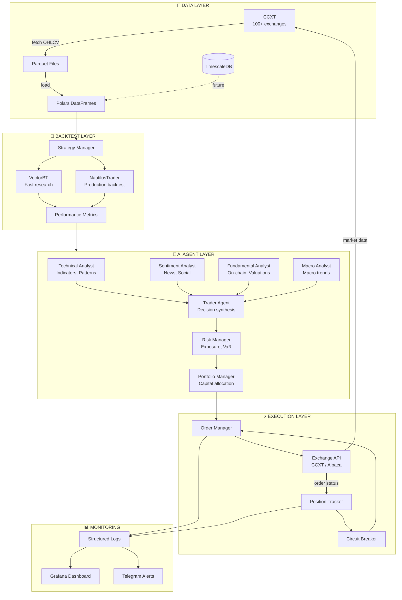
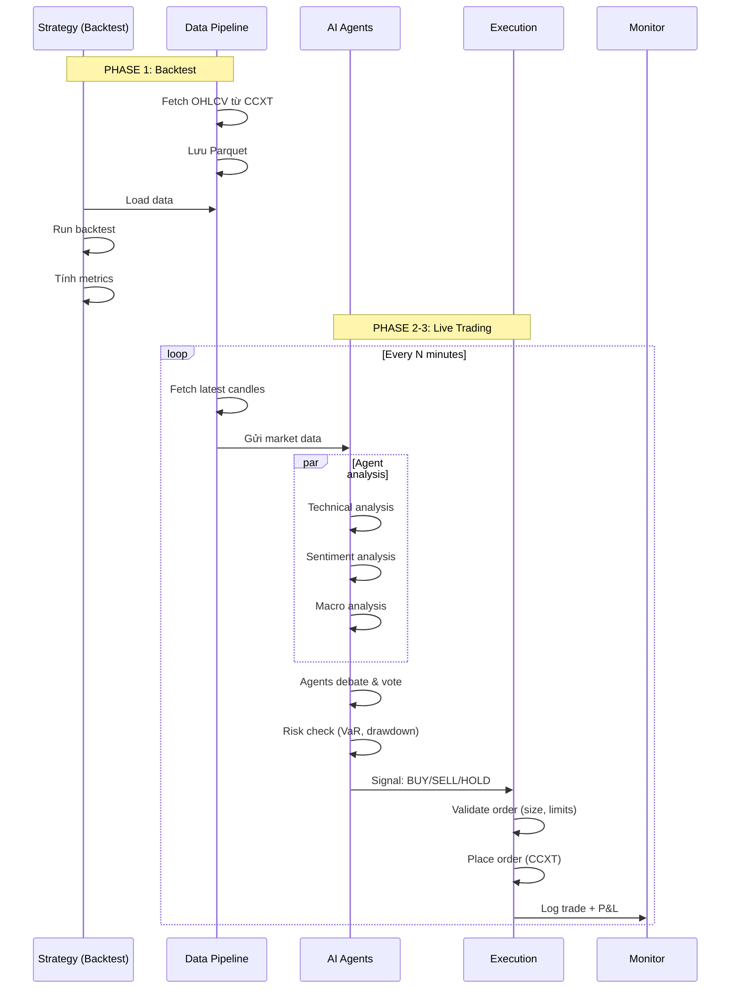
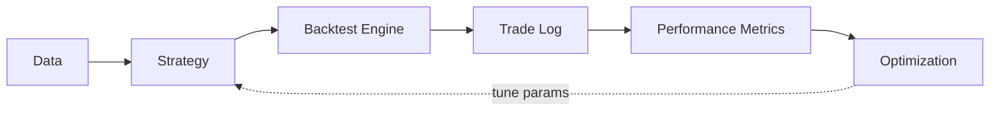
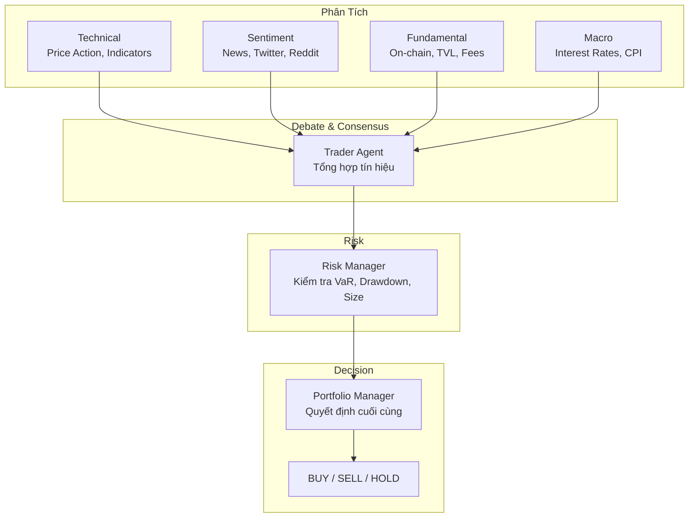
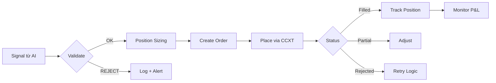

# 🏛 Kiến Trúc Hệ Thống

> File này giải thích kiến trúc tổng thể của Trading Agent System — các layer,
> luồng dữ liệu, cách các module giao tiếp với nhau.

---

## 📐 Kiến trúc tổng thể (Layer Diagram)



---

## 🔄 Luồng dữ liệu & Ra quyết định



---

## 🧱 Chi tiết từng Layer

### 📡 Data Layer (`src/trading_agent/data/`)

```
collector.py    ← CCXT fetch + pagination + retry
storage.py      ← Parquet save/load
types.py        ← OHLCV dataclass + Timeframe enum
```

| Thành phần | Input | Output | Ghi chú |
|-----------|-------|--------|---------|
| Collector | symbol + timeframe + since | Polars DataFrame | Paginated fetch, auto rate-limit |
| Storage | DataFrame | `.parquet` file | Append + dedup, theo cấu trúc `exchange/symbol/tf.parquet` |
| CLI | User command | Console output | `trading-agent data fetch/inspect/list-datasets` |

**Cấu trúc thư mục data:**
```
data/raw/
├── binance/
│   ├── BTC_USDT/
│   │   ├── 1h.parquet
│   │   └── 1d.parquet
│   └── ETH_USDT/
│       └── 1h.parquet
└── bybit/
    └── ...
```

---

### 🧪 Backtest Layer (Phase 1 — đang xây dựng)



**2 engine song song:**
| Engine | Khi nào dùng | Ưu điểm |
|--------|-------------|---------|
| **VectorBT** | Parameter sweep, quick research | 167x nhanh hơn Backtrader |
| **NautilusTrader** | Production backtest, fill modeling | Rust core, event-driven, sát live nhất |

---

### 🤖 AI Agent Layer (Phase 2 — đang thiết kế)



**Các agent:**
| Agent | Nguồn dữ liệu | Công cụ |
|-------|--------------|---------|
| Technical Analyst | OHLCV, indicators | TA-Lib, pandas_ta |
| Sentiment Analyst | News API, Twitter, Reddit | LLM + Web search |
| Fundamental Analyst | On-chain data (CoinGecko, Dune) | API + LLM |
| Macro Analyst | Economic calendar, Fed | Web fetch + LLM |
| Trader Agent | Signals từ analysts | LLM debate + voting |
| Risk Manager | Current positions, volatility | Tính VaR, max drawdown |
| Portfolio Manager | All signals + risk | LLM + rules |

---

### ⚡ Execution Layer (Phase 3 — đang thiết kế)



**Safety checks trước khi execute:**
1. ✅ Symbol có khớp lệnh không?
2. ✅ Số lượng có nằm trong giới hạn không?
3. ✅ Có đủ balance không?
4. ✅ Drawdown hiện tại có vượt ngưỡng không?
5. ✅ Giá hiện tại có outlier không?

---

## 📁 Cấu trúc thư mục

```
trading-agent/
├── config/                  # Configuration (YAML)
│   └── config.yaml
├── src/
│   └── trading_agent/
│       ├── __init__.py
│       ├── cli.py           # CLI entry point
│       ├── config/
│       │   └── loader.py    # Config parser
│       ├── data/
│       │   ├── collector.py # CCXT fetcher
│       │   ├── storage.py   # Parquet IO
│       │   └── types.py     # OHLCV types
│       ├── strategies/      # Strategy zoo (Phase 1)
│       ├── backtest/        # Backtest runner (Phase 1)
│       └── agents/          # AI agents (Phase 2)
├── data/                    # Market data
│   ├── raw/                 # Raw OHLCV parquet
│   └── processed/           # Feature-engineered data
├── tests/                   # Unit tests
├── notebooks/               # Jupyter notebooks
├── docs/                    # 📘 BẠN ĐANG Ở ĐÂY
├── docker-compose.yml       # Infra stack
├── Dockerfile               # App container
├── Makefile                 # Command shortcuts
├── pyproject.toml           # Python project
└── README.md                # Project overview
```

> 📖 Xem chi tiết từng file trong [project-structure.md](project-structure.md)
> 🧠 Xem quy trình suy luận trong [reasoning.md](reasoning.md)
> 🎮 Xem demo từng bước trong [demo.md](demo.md)
