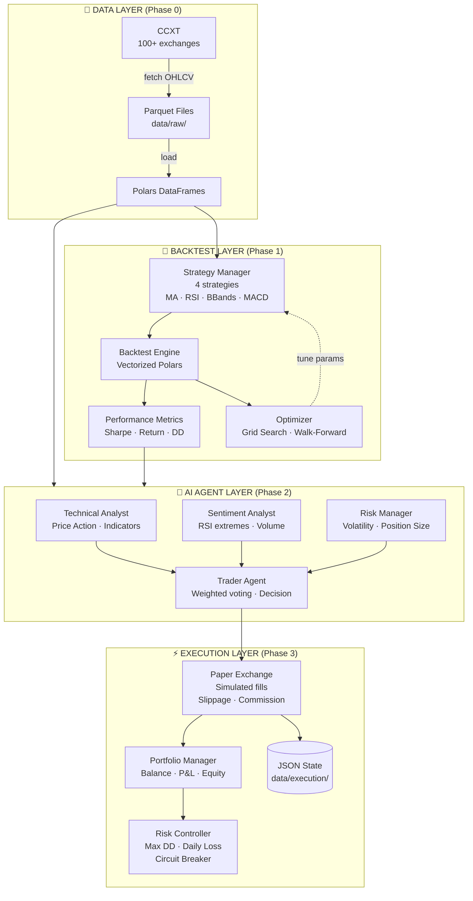
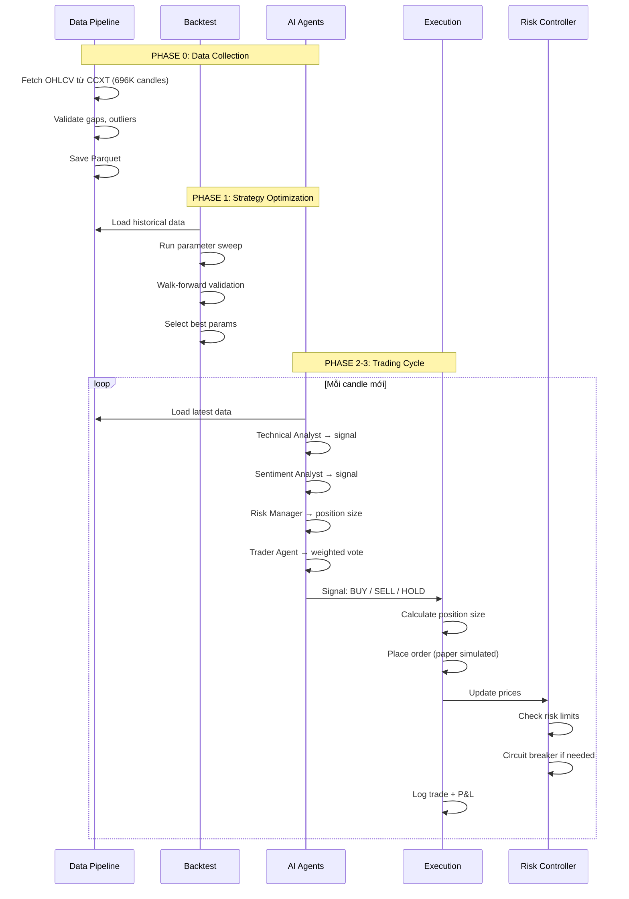
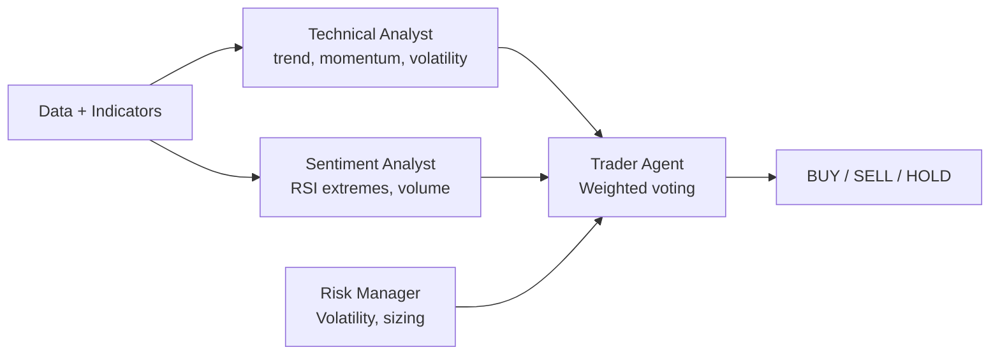

# 🏛 Kiến Trúc Hệ Thống

> File này giải thích kiến trúc tổng thể của Trading Agent System — các layer,
> luồng dữ liệu, cách các module giao tiếp với nhau.
>
> **Phiên bản hiện tại:** v0.3.0 (Phase 0–3 đã hoàn thành)

---

## 📐 Kiến trúc tổng thể (Layer Diagram)



---

## 🔄 Luồng dữ liệu & Ra quyết định



---

## 🧱 Chi tiết từng Layer

### 📡 Data Layer — Phase 0 ✅

```
src/trading_agent/data/
├── collector.py    ← CCXT fetch + pagination + retry + validate
├── storage.py      ← Parquet save/load (append + dedup)
└── types.py        ← OHLCV types + timeframe enum
```

| Thành phần | Input | Output | Ghi chú |
|-----------|-------|--------|---------|
| Collector | symbol + timeframe + since | Polars DataFrame | Paginated fetch, auto rate-limit |
| Storage | DataFrame | `.parquet` file | Append + dedup, cấu trúc `exchange/symbol/tf.parquet` |
| validate_data | DataFrame | Gap/outlier/null report | Data quality assurance |

**Dữ liệu hiện tại:** 5 symbols × 4 timeframes = 20 datasets, 696K candles, 0 gaps.

---

### 🧪 Backtest Layer — Phase 1 ✅

```
src/trading_agent/
├── strategies/
│   ├── base.py       ← Abstract Strategy class + registry
│   ├── ma_crossover.py  ← MA Crossover (fast=5, slow=20)
│   ├── rsi.py        ← RSI Mean Reversion (period=7, oversold=25)
│   └── bbands.py     ← Bollinger Bands (period=10, std=2.5)
└── backtest/
    ├── engine.py     ← Vectorized backtest runner (Polars)
    └── metrics.py    ← Performance metrics
```

**4 strategies implemented:**
| Strategy | Params tối ưu | OOS Return | Sharpe |
|----------|--------------|------------|--------|
| MA Crossover | fast=5, slow=20 | **+11.22%** | 1.67 |
| RSI | period=7, oversold=25, overbought=75 | **+3.29%** | 1.06 |
| Bollinger Bands | period=10, std=2.5 | **+1.70%** | 1.07 |
| MACD | default | baseline | — |

**Optimization:** Grid search + Walk-forward validation (2y train / 1y test).

---

### 🤖 AI Agent Layer — Phase 2 ✅

```
src/trading_agent/agents/
├── base.py         ← AgentMessage dataclass + Agent interface
├── llm.py          ← LLM client (OpenRouter/DeepSeek/OpenAI/Ollama)
├── technical.py    ← Technical Analyst agent
├── sentiment.py    ← Sentiment Analyst agent
├── risk.py         ← Risk Manager agent
├── trader.py       ← Trader Agent (decision synthesis)
└── orchestrator.py ← Orchestrator (runs full analysis cycle)
```

**4 agents hoạt động end-to-end:**



**Luồng xử lý mỗi agent:**
1. Nhận context: giá hiện tại, indicators, vị thế
2. LLM phân tích với prompt chuyên biệt
3. Output: signal + confidence + reasoning
4. Trader Agent tổng hợp bằng weighted voting

**LLM Provider Chain:**
```
Primary:   DeepSeek V4 Flash (OpenRouter free)  → ~$0.00003/req
Fallback:  GPT-4o-mini (OpenAI)                  → ~$0.0004/req
Local:     Qwen2.5:7b (Ollama)                   → Free
```

---

### ⚡ Execution Layer — Phase 3 ✅

```
src/trading_agent/execution/
├── types.py            ← Order, Trade, Position dataclasses
├── paper_exchange.py   ← Simulated exchange (no real API)
├── engine.py           ← Unified execution interface
└── risk_controller.py  ← Risk limits + circuit breaker
```

**Paper Exchange:**
```python
engine = ExecutionEngine(initial_capital=10_000.0)
engine.exchange.place_order("BTC/USDT", "buy", "market", amount=0.039)
engine.update_prices({"BTC/USDT": 66000.0})
print(engine.get_summary())
# Equity: $10,082.64  |  Unrealized P&L: +$85.15  |  Return: +0.83%
```

| Feature | Mô tả |
|---------|-------|
| Market orders | Fill ngay tại current price + slippage |
| Limit orders | Fill khi price cross limit |
| Stop-loss | Trigger + market fill khi price chạm stop |
| Slippage | 0.05% (cấu hình được) |
| Commission | 0.1% (Binance spot rate) |
| State persistence | JSON file, survive restart |

**Risk Controller:**
| Check | Limit | Hành vi khi vi phạm |
|-------|-------|---------------------|
| Max Drawdown | 15% | Circuit breaker → close all |
| Daily Loss | 8% | Circuit breaker → close all |
| Position Concentration | 50% | Warning + prevent new entry |
| Cooldown | 24h | Ngăn trade mới sau stop-loss |

---

## 📁 Cấu trúc thư mục

```
trading-agent/
├── config/                  # Configuration (YAML)
│   └── config.yaml
├── src/
│   └── trading_agent/
│       ├── cli.py           # CLI entry point (Click + Rich)
│       ├── config/
│       │   └── loader.py    # Config parser
│       ├── data/            # Phase 0: Data Pipeline
│       │   ├── collector.py # CCXT fetcher
│       │   ├── storage.py   # Parquet IO
│       │   └── types.py     # OHLCV types
│       ├── strategies/      # Phase 1: Strategy Library
│       │   ├── base.py
│       │   ├── ma_crossover.py
│       │   ├── rsi.py
│       │   └── bbands.py
│       ├── backtest/        # Phase 1: Backtest Engine
│       │   ├── engine.py
│       │   └── metrics.py
│       ├── agents/          # Phase 2: AI Multi-Agent
│       │   ├── base.py
│       │   ├── llm.py
│       │   ├── technical.py
│       │   ├── sentiment.py
│       │   ├── risk.py
│       │   ├── trader.py
│       │   └── orchestrator.py
│       └── execution/       # Phase 3: Execution & Risk
│           ├── types.py
│           ├── paper_exchange.py
│           ├── engine.py
│           └── risk_controller.py
├── data/                    # Market data
│   ├── raw/                 # OHLCV parquet files
│   └── execution/           # Paper exchange state
├── docs/                    # Documentation
├── docker-compose.yml       # Infra stack
├── Makefile                 # Command shortcuts
├── pyproject.toml           # Python project
└── README.md                # Project overview
```

---

> 📖 Xem chi tiết từng file trong [project-structure.md](../project-structure.md)
> 🧠 Xem quy trình suy luận trong [reasoning.md](../reasoning.md)
> 🎮 Xem demo từng bước trong [demo.md](../demo.md)
> ⚡ Xem tối ưu hóa trong [optimization.md](../optimization.md)
