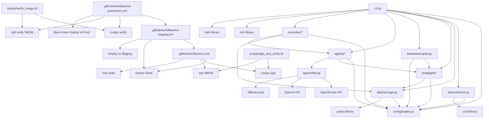

# 📁 Cấu Trúc Mã Nguồn

> Mỗi module làm gì, nằm ở đâu, phụ thuộc vào module nào.
>
> **Phiên bản:** v0.3.0 · Toàn bộ Phase 0–3 đã implemented.

---

## Cây thư mục đầy đủ

```
trading-agent/
│
├── config/                          # 🛠 Cấu hình hệ thống
│   └── config.yaml                  #   File cấu hình chính (YAML)
│       ├── exchanges                #   Danh sách sàn giao dịch
│       ├── symbols                  #   Cặp giao dịch mặc định (5 symbols)
│       ├── data                     #   Cấu hình data pipeline
│       ├── backtest                 #   Default backtest params
│       ├── llm                      #   Cấu hình LLM (DeepSeek/GPT/Ollama)
│       └── execution                #   Capital, commission, slippage
│
├── src/trading_agent/               # 📦 Mã nguồn chính
│   ├── __init__.py
│   │
│   ├── cli.py                       # 🎮 CLI (Click + Rich)
│   │   ├── main()                   #   Entry point
│   │   ├── info                     #   System info
│   │   ├── data group               #   Data commands (fetch, inspect, ...)
│   │   ├── backtest group           #   Backtest commands (run, list)
│   │   ├── config group             #   Config commands (validate)
│   │   ├── agents group             #   Agent commands (analyze, list)
│   │   └── execution group          #   Execution commands (status, run, trades, ...)
│   │
│   ├── config/                      # ⚙️ Config Loader
│   │   ├── __init__.py
│   │   └── loader.py                #   Đọc & parse config.yaml
│   │       ├── Config class         #   Typed config với defaults
│   │       └── config singleton     #   Load 1 lần, dùng global
│   │
│   ├── data/                        # 📡 Phase 0: Data Layer
│   │   ├── __init__.py
│   │   ├── types.py                 #   OHLCV types + Timeframe enum
│   │   ├── collector.py             #   📥 CCXT Data Collector
│   │   │   ├── get_exchange()       #     Exchange factory (cached)
│   │   │   ├── Collector class      #     Fetch OHLCV từ 1 exchange
│   │   │   │   ├── fetch_ohlcv()    #       Paginated fetch
│   │   │   │   ├── update_ohlcv()   #       Incremental update
│   │   │   │   ├── validate_data()  #       Data quality report
│   │   │   │   └── available_symbols() #    Danh sách symbol
│   │   │   └── download_all_symbols() #  High-level download (all config)
│   │   │   └── validate_all_symbols() #  Validate all datasets
│   │   └── storage.py               #   💾 Data Storage
│   │       ├── save_ohlcv()         #     Save → Parquet (append + dedup)
│   │       ├── load_ohlcv()         #     Load Parquet → DataFrame
│   │       ├── get_date_range()     #     Date range info
│   │       └── list_datasets()      #     Scan storage listing
│   │
│   ├── strategies/                  # 🧪 Phase 1: Strategy Library
│   │   ├── __init__.py
│   │   ├── base.py                  #   Abstract Strategy + registry
│   │   │   ├── Strategy(ABC)        #     Interface: on_data, on_signal
│   │   │   └── registry             #     Strategy registry pattern
│   │   ├── ma_crossover.py          #   📈 MA Crossover (fast=5, slow=20)
│   │   ├── rsi.py                   #   📉 RSI Mean Reversion (period=7)
│   │   └── bbands.py                #   📊 Bollinger Bands (period=10, std=2.5)
│   │
│   ├── backtest/                    # 📊 Phase 1: Backtest Engine
│   │   ├── __init__.py
│   │   ├── engine.py                #   Vectorized backtest runner (Polars)
│   │   │   ├── BacktestEngine       #     Single backtest
│   │   │   └── run_backtest()       #     High-level runner
│   │   └── metrics.py               #   Performance metrics
│   │       ├── calculate_metrics()  #     Sharpe, Sortino, DD, Win Rate...
│   │       └── print_metrics()      #     Rich table output
│   │
│   ├── agents/                      # 🤖 Phase 2: AI Multi-Agent
│   │   ├── __init__.py
│   │   ├── base.py                  #   AgentMessage dataclass
│   │   ├── llm.py                   #   🔗 LLM Client
│   │   │   ├── LLMClient            #     Unified LLM interface
│   │   │   ├── chat()               #     Chat completion
│   │   │   └── ask_agent()          #     Agent-specific prompting
│   │   ├── technical.py             #   📈 Technical Analyst
│   │   ├── sentiment.py             #   💬 Sentiment Analyst
│   │   ├── risk.py                  #   🛡️ Risk Manager
│   │   ├── trader.py                #   🎯 Trader Agent (weighted voting)
│   │   └── orchestrator.py          #   🔄 Orchestrator
│   │       ├── analyze()            #     Run full 4-agent cycle
│   │       └── print_report()       #     Pretty output
│   │
│   └── execution/                   # ⚡ Phase 3: Execution & Risk
│       ├── __init__.py
│       ├── types.py                 #   Order, Trade, Position dataclasses
│       ├── paper_exchange.py        #   📄 Simulated exchange
│       │   ├── PaperExchange        #     Place/cancel/fill orders
│       │   ├── update_prices()      #     Price feed + stop-loss check
│       │   ├── close_all_positions()#     Kill switch
│       │   └── state persistence    #     JSON file
│       ├── engine.py                #   🎯 Execution Engine
│       │   ├── execute_signal()     #     AgentMessage → Order
│       │   ├── set_stop_loss()      #     Auto stop-loss
│       │   ├── get_summary()        #     Portfolio summary
│       │   └── close_all()          #     Emergency close
│       └── risk_controller.py       #   🛡️ Risk Controller
│           ├── check_all()          #     Run all risk checks
│           ├── max_drawdown check   #     15% limit
│           ├── daily_loss check     #     8% limit
│           ├── position_concentration #  50% limit
│           └── circuit_breaker      #     Kill + cooldown
│
├── data/                            # 📂 Dữ liệu market
│   ├── raw/                         #   OHLCV Parquet files
│   │   └── binance/
│   │       ├── BTC_USDT/{1h,4h,1d}.parquet
│   │       ├── ETH_USDT/{1h,4h,1d}.parquet
│   │       └── ...
│   ├── execution/                   #   Paper exchange state
│   │   └── paper_binance.json
│   └── processed/                   #   Feature-engineered (future)
│
├── docs/                            # 📘 Tài liệu
│   ├── README.md                    #   Index
│   ├── architecture.md              #   Kiến trúc hệ thống
│   ├── reasoning.md                 #   Quy trình suy luận
│   ├── demo.md                      #   Demo hướng dẫn chạy
│   ├── project-structure.md         #   Cấu trúc mã nguồn (file này)
│   ├── getting-started.md           #   Quick start
│   └── optimization.md              #   Tối ưu hóa hệ thống
│
├── docker-compose.yml               # 🐳 Docker Compose (infra future)
├── Dockerfile                       # 🐳 Docker image
├── Makefile                         # 🔨 Command shortcuts
├── pyproject.toml                   # 📦 Poetry project
├── README.md                        # 📖 Project overview
├── TRADING_SYSTEM_OVERVIEW.md        # 📐 Tổng quan chiến lược
├── .github/                         # 🤖 CI/CD Workflows
│   └── workflows/
│       ├── ci.yml                   #   CI: lint, test, security, build+sign
│       ├── cd-staging.yml           #   CD: Deploy to staging
│       └── cd-production.yml        #   CD: Deploy to production (signed + verified)
│
├── scripts/                         # 🛠️ Utility Scripts (Phase 5)
│   ├── sign_and_verify.sh           #   Cosign sign + Syft SBOM + verify
│   ├── verify_image.sh              #   Verify cosign signature + SBOM locally
│   ├── db_stats.py                  #   DB statistics
│   ├── db_backup.py                 #   DB backup to S3/GCS
│   ├── db_restore.py                #   DB restore from backup
│   └── notify.py                    #   Telegram/Slack notifications
│
├── .github/                         # 🔄 GitHub Actions CI/CD
│   └── workflows/
│       ├── ci.yml                   #   CI: lint, test, security, build, sign, SBOM
│       ├── cd-staging.yml           #   CD Staging: verify sign+SBOM → deploy
│       └── cd-production.yml        #   CD Production: manual, verify → blue-green
│
├── scripts/                         # 🛠 Scripts tiện ích
│   ├── sign_and_verify.sh           #   Cosign sign + verify image
│   └── verify_image.sh              #   Verify cosign + SBOM locally
│
├── docker-compose.yml               # 🐳 Docker Compose (infra future)
├── Dockerfile                       # 🐳 Docker image
├── Makefile                         # 🔨 Command shortcuts
├── pyproject.toml                   # 📦 Poetry project
├── README.md                        # 📖 Project overview
├── TRADING_SYSTEM_OVERVIEW.md        # 📐 Tổng quan chiến lược
├── .gitignore
└── .env                             # 🔐 Environment variables (gitignored)
```

---

## 🗺 Sơ đồ phụ thuộc giữa các module



---

## 📌 Quy ước đặt tên

| Quy tắc | Ví dụ | Giải thích |
|---------|-------|-----------|
| Module/file: snake_case | `data/collector.py` | Tuân theo PEP8 |
| Class: PascalCase | `class Collector:` | Python convention |
| Function: snake_case | `def fetch_ohlcv():` | PEP8 |
| Private: _prefix | `def _fetch_paginated():` | Internal use |
| Constant: UPPER_CASE | `DEFAULT_TIMEFRAME = "1h"` | Config constants |
| Symbol format | `BTC/USDT` | CCXT format |
| Exchange folder | `binance/BTC_USDT/` | Symbol / → _ in path |

---

> 📖 Quay lại [tài liệu chính](README.md)
