# 📁 Cấu Trúc Mã Nguồn

> Cấu trúc sau khi dọn dẹp. Tree thật (auto-generated): [`PROJECT_MAP.md`](PROJECT_MAP.md).
>
> **Phiên bản:** v1.0.0 · Implementation 7 phase xong · **mainnet NO-GO**

---

## Cây thư mục tổng quan

```
trading-agent/
│
├── src/trading_agent/          # 📦 Mã nguồn chính (133 modules)
│   ├── cli.py                  # 🎮 CLI (Click + Rich) — 12 command groups
│   ├── log_config.py           # 📝 Logging setup
│   ├── regime.py               # 🌡 Regime detection facade
│   │
│   ├── agents/                 # 🤖 AI Multi-Agent (Phase 2)
│   │   ├── base.py             #   AgentMessage dataclass
│   │   ├── llm.py              #   LLM client + fallback chain
│   │   ├── technical.py        #   📈 Technical Analyst
│   │   ├── sentiment.py        #   💬 Sentiment Analyst
│   │   ├── risk.py             #   🛡 Risk Manager
│   │   ├── trader.py           #   🎯 Trader Agent (weighted voting)
│   │   ├── orchestrator.py     #   🔄 Orchestrator — full 4-agent cycle
│   │   ├── portfolio.py        #   💼 Portfolio Manager
│   │   └── swarm/              #   🐝 Agent swarm (coordinator + registry + specialized)
│   │
│   ├── config/                 # ⚙️ Config
│   │   └── loader.py           #   Typed config + singleton
│   │
│   ├── data/                   # 📡 Data Layer (Phase 0)
│   │   ├── collector.py        #   CCXT collector (fetch/update/validate)
│   │   ├── storage.py          #   Parquet storage (save/load/dedup)
│   │   ├── pipeline.py         #   Data pipeline orchestration
│   │   ├── market_data.py      #   Market data service
│   │   ├── dex_integration.py  #   DEX data integration
│   │   ├── onchain.py          #   On-chain data
│   │   └── options_provider.py #   Options chain data
│   │
│   ├── strategies/             # 🧪 Strategy Library (Phase 1 + Tier 2/3)
│   │   ├── base.py             #   Abstract Strategy + registry
│   │   ├── ma_crossover.py     #   MA Crossover
│   │   ├── rsi.py              #   RSI Mean Reversion
│   │   ├── bbands.py           #   Bollinger Bands
│   │   ├── enhanced_ma.py      #   ⭐ Enhanced MA (ADX filter) — chiến lược live
│   │   ├── agent_ensemble.py   #   Agent ensemble strategy
│   │   ├── regime_switching.py #   Regime-switching (Tier 3)
│   │   ├── online_learning_strategy.py
│   │   ├── options_strategies.py  #   Vol selling, gamma scalping, dispersion
│   │   ├── sandbox.py          #   Strategy sandbox
│   │   └── plugins/            #   🔌 Plugin marketplace (pluggy)
│   │       └── versioning/     #   📦 Strategy versioning (git store + ABI)
│   │
│   ├── backtest/               # 📊 Backtest Engine (Phase 1)
│   │   ├── engine.py           #   Vectorized backtest (Polars) + event-driven
│   │   └── metrics.py          #   Sharpe, Sortino, DD, Win Rate...
│   │
│   ├── execution/              # ⚡ Execution & Risk (Phase 3)
│   │   ├── types.py            #   Order, Trade, Position
│   │   ├── paper_exchange.py   #   📄 Simulated exchange
│   │   ├── engine.py           #   Execution engine + ATR trailing stop
│   │   ├── risk_controller.py  #   Stop-loss, DD limit, circuit breaker
│   │   ├── indicators.py       #   Technical indicators (ATR...)
│   │   ├── monitoring.py       #   Execution monitoring
│   │   └── smart_router.py     #   Order routing (TWAP/VWAP...)
│   │
│   ├── exchanges/              # 🌐 Exchange Adapters (Phase 6)
│   │   ├── ccxt_adapter.py     #   CCXT — 8 CEX
│   │   ├── alpaca_adapter.py   #   🏦 Alpaca — stocks (live paper)
│   │   ├── oanda_adapter.py    #   💱 OANDA — forex
│   │   ├── live_broker.py      #   🟢 LiveBroker facade (Tier 3 live)
│   │   ├── order_router.py     #   Best Price/TWAP/VWAP/Split
│   │   ├── websocket_manager.py#   WS streaming
│   │   ├── health_monitor.py   #   Exchange health + failover
│   │   ├── models.py           #   Exchange models
│   │   ├── dex/                #   Uniswap V3, Jupiter, PancakeSwap
│   │   └── futures/            #   Binance/Bitget futures, Deribit options
│   │
│   ├── portfolio/              # 💼 Portfolio Management (Phase 6)
│   │   ├── portfolio_optimizer.py   #   Black-Litterman, MPT
│   │   ├── risk_budgeting.py        #   Risk parity, HRP
│   │   ├── auto_rebalancer.py       #   Auto-rebalance
│   │   ├── capital_allocation/       #   Allocation + Kelly
│   │   └── attribution/              #   Performance attribution
│   │
│   ├── risk/                   # 🛡 Risk & Sizing
│   │   ├── position_sizer.py   #   ATR / fixed_pct / Kelly sizing
│   │   └── portfolio_risk.py   #   Portfolio-level risk
│   │
│   ├── ml/                     # 🧠 Adaptive ML (Phase 6)
│   │   ├── regime_detection.py #   HMM/GMM regime
│   │   ├── meta_learning.py    #   MAML/Reptile
│   │   ├── online/             #   Online learning (River)
│   │   ├── rl_agent.py         #   RL agent (DQN/PPO)
│   │   ├── auto_alpha.py       #   Auto-alpha generator
│   │   ├── sentiment.py        #   ML sentiment
│   │   └── strategy_cloner.py  #   Strategy cloning
│   │
│   ├── alpha_research/         # 🔬 Alpha Research (Tier 2)
│   │   └── pipeline.py         #   Factor scan pipeline
│   │
│   ├── features/llm/           # 📰 LLM Feature Pipeline
│   │   ├── pipeline.py         #   News/social/earnings LLM analysis
│   │   ├── news.py · social.py · earnings.py
│   │
│   ├── events/                 # 🎯 Event Sourcing (Phase 6)
│   │   ├── models.py           #   Event models
│   │   ├── store.py            #   Event store
│   │   ├── projections.py      #   Projections
│   │   └── projection_manager.py
│   │
│   ├── messaging/              # 📨 Messaging
│   │   ├── nats_bus.py         #   NATS
│   │   └── redis_streams.py    #   Redis Streams
│   │
│   ├── monitoring/             # 🖥 Monitoring (Phase 4/5)
│   │   ├── metrics.py          #   Metrics engine
│   │   ├── metrics_server.py   #   Metrics HTTP server
│   │   ├── alerter.py          #   Telegram/Slack alerts
│   │   └── database.py         #   SQLite DB
│   │
│   ├── infrastructure/         # 🏗 Infra (Phase 6)
│   │   ├── chaos/              #   Chaos experiments
│   │   └── multi_region/       #   K8s multi-region sync
│   │
│   ├── infra/                  #   Multi-region helper
│   ├── llm/                    #   LLM pool + client
│   └── enterprise/             #   REST API
│
├── config/                     # 🛠 Cấu hình (config.yaml)
├── data/                       # 📂 Dữ liệu market (parquet, gitignored)
│   ├── raw/                    #   OHLCV parquet
│   ├── processed/              #   Feature-engineered
│   └── execution/              #   Paper/live state
│
├── docs/                       # 📘 Tài liệu
├── scripts/                    # 🛠 Scripts vận hành
│   ├── live_cron_runner.py     #   ⭐ Live trading runner (cron hourly)
│   ├── live_enhanced_ma.py     #   Live Enhanced MA
│   ├── cron_wrapper.sh         #   Cron wrapper (trade/backup/retention)
│   ├── trade_local.py          #   Local paper trading
│   ├── backtest_local.py       #   Local backtest
│   ├── backup.sh / backup_local.py / restore.sh   # Backup/restore
│   ├── health_check.sh / check_metrics.py         # Health
│   ├── watchdog.sh             #   ⭐ Auto-restart watchdog (@reboot)
│   ├── monthly_wfo.py · wfo_optimize.py · wfo_ma_adx.py · multi_symbol_bench.py
│   ├── benchmark_phase6.py · load_test_phase6.py · chaos_dryrun.py
│   └── qwenpaw_control/        #   Task control toolkit
│
├── dashboard/                  # 📊 Streamlit dashboard
├── monitoring/                 # 🖥 Prometheus/Grafana/Loki configs
├── infrastructure/k8s/         # ☸ K8s multi-region manifests
├── tests/                      # 🧪 740 tests
├── Dockerfile · docker-compose.yml · docker-compose.prod.yml
├── Makefile · pyproject.toml · poetry.lock
├── .github/workflows/          # 🤖 CI/CD
└── README.md · TRADING_SYSTEM_OVERVIEW.md · BACKTEST_SUMMARY.md
```

---

## 🗺 Sơ đồ kiến trúc tổng thể

```mermaid
graph TD
    CRON[Cron: hourly/2h/23h/retention] --> CRW[cron_wrapper.sh]
    CRON2[QwenPaw job: Live EMA hourly] --> LCR[live_cron_runner.py]
    LCR --> LB[LiveBroker]
    LCR --> EMA[enhanced_ma strategy]
    LCR --> ALPACA[Alpaca Paper API]
    LCR --> TELEGRAM[Telegram notify]

    CRW --> TRADE[trade_local.py / live]
    CRW --> BACKUP[backup.sh]
    CRW --> RETENTION[data retention]

    CLI[cli.py] --> DATA[data/*]
    CLI --> BT[backtest/engine]
    CLI --> STRAT[strategies/*]
    CLI --> AGENTS[agents/*]
    CLI --> EXEC[execution/*]
    CLI --> PORT[portfolio/*]
    CLI --> OPT[options_strategies]
    CLI --> META[ml/meta_learning]

    DATA --> STORAGE[data/storage.py → Parquet]
    BT --> STRAT
    AGENTS --> LLM[llm/client + pool → OpenCode/DeepSeek]
    EXEC --> RISK[risk_controller]
    EXEC --> PAPER[paper_exchange]
    EXEC --> ROUTER[order_router]
    ROUTER --> ADAPTERS[ccxt/alpaca/oanda/dex/futures]

    PORT --> ALLOC[capital_allocation/kelly]
    PORT --> OPTZ[portfolio_optimizer]
    PORT --> REBAL[auto_rebalancer]

    MON[monitoring/*] --> SQLITE[SQLite history.db]
    MON --> TELEGRAM
    DASH[dashboard/app.py] --> SQLITE

    MSG[messaging/*] --> NATS[Redis/NATS]
```



---

## 📌 Quy ước

| Quy tắc | Ví dụ |
|---------|-------|
| Module/file: snake_case | `data/collector.py` |
| Class: PascalCase | `class Collector:` |
| Symbol format | `BTC/USDT` (CCXT) |
| Storage path | `data/raw/binance/BTC_USDT/1h.parquet` |

---

> 📖 Quay lại [tài liệu chính](README.md)
