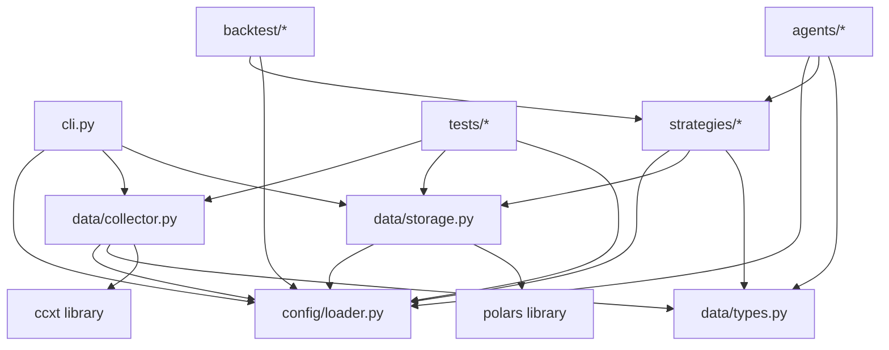

# 📁 Cấu Trúc Mã Nguồn

> Mỗi module làm gì, nằm ở đâu, phụ thuộc vào module nào.

---

## Cây thư mục đầy đủ

```
trading-agent/
│
├── config/                          # 🛠 Cấu hình hệ thống
│   ├── config.yaml                  #   File cấu hình chính (YAML)
│   │   ├── exchanges                #   Danh sách sàn giao dịch
│   │   ├── symbols                  #   Cặp giao dịch mặc định
│   │   ├── data                     #   Cấu hình data pipeline
│   │   ├── backtest                 #   Default backtest params
│   │   ├── llm                      #   Cấu hình LLM (Phase 2+)
│   │   └── logging                  #   Logging config
│   └── ...                          #   Thêm file config khác nếu cần
│
├── src/trading_agent/               # 📦 Mã nguồn chính
│   ├── __init__.py                  #   Package init
│   │
│   ├── cli.py                       # 🎮 Command-Line Interface
│   │   ├── main()                   #   Entry point: trading-agent
│   │   ├── data group               #   Nhóm lệnh data:
│   │   │   ├── fetch                #     Fetch OHLCV
│   │   │   ├── inspect              #     Inspect stored data
│   │   │   ├── list-datasets        #     List datasets
│   │   │   ├── download-all         #     Download all symbols
│   │   │   ├── list-exchanges       #     List configured exchanges
│   │   │   └── list-symbols         #     List configured symbols
│   │   └── info                     #   Show system info
│   │
│   ├── config/                      # ⚙️ Config Loader
│   │   ├── __init__.py
│   │   └── loader.py                #   Đọc & parse config.yaml
│   │       ├── Config class         #   Typed config với defaults
│   │       └── config singleton     #   Load 1 lần, dùng global
│   │
│   ├── data/                        # 📡 Data Layer
│   │   ├── __init__.py
│   │   ├── types.py                 #   Kiểu dữ liệu
│   │   │   ├── OHLCV dataclass      #     Một candle
│   │   │   ├── OHLCVList            #     Collection của candles
│   │   │   └── Timeframe enum       #     Chuẩn hóa timeframe
│   │   ├── collector.py             #   📥 CCXT Data Collector
│   │   │   ├── get_exchange()       #     Exchange factory (cache)
│   │   │   ├── Collector class      #     Fetch OHLCV từ 1 exchange
│   │   │   │   ├── fetch_ohlcv()    #       Public fetch
│   │   │   │   ├── available_symbols() #    Danh sách symbol
│   │   │   │   └── _fetch_paginated() #   Paginated với progress bar
│   │   │   └── download_all_symbols() #  High-level download
│   │   └── storage.py               #   💾 Data Storage
│   │       ├── save_ohlcv()         #     Save DataFrame → Parquet
│   │       ├── load_ohlcv()         #     Load Parquet → DataFrame
│   │       └── list_datasets()      #     Scan storage listing
│   │
│   ├── strategies/                  # 🧪 Strategy Library (Phase 1)
│   │   ├── __init__.py
│   │   └── base.py                  #   Base strategy class
│   │       ├── Strategy(ABC)        #     Abstract interface
│   │       │   ├── on_data()        #       Xử lý data vào
│   │       │   ├── on_signal()      #       Tạo signal
│   │       │   └── indicators()     #       Tính indicators
│   │       └── registry             #     Strategy registry pattern
│   │
│   ├── backtest/                    # 📊 Backtest Engine (Phase 1)
│   │   ├── __init__.py
│   │   ├── engine.py                #   Backtest runner
│   │   ├── metrics.py               #   Performance metrics
│   │   └── optimiser.py             #   Parameter optimiser
│   │
│   └── agents/                      # 🤖 AI Agents (Phase 2)
│       ├── __init__.py
│       ├── base.py                  #   Base agent class
│       ├── technical.py             #   Technical analyst
│       ├── sentiment.py             #   Sentiment analyst
│       ├── fundamental.py           #   Fundamental analyst
│       ├── macro.py                 #   Macro analyst
│       ├── trader.py                #   Trader agent
│       ├── risk_manager.py          #   Risk manager
│       └── portfolio_manager.py     #   Portfolio manager
│
├── data/                            # 📂 Dữ liệu market
│   ├── raw/                         #   Raw OHLCV Parquet
│   │   └── binance/
│   │       ├── BTC_USDT/
│   │       │   ├── 1h.parquet
│   │       │   ├── 4h.parquet
│   │       │   └── 1d.parquet
│   │       └── ETH_USDT/
│   │           └── 1h.parquet
│   └── processed/                   #   Feature-engineered (sau này)
│
├── tests/                           # 🧪 Unit tests
│   ├── __init__.py
│   ├── test_collector.py
│   ├── test_storage.py
│   └── test_config.py
│
├── notebooks/                       # 📓 Jupyter notebooks
│   └── .gitkeep
│
├── docs/                            # 📘 Tài liệu (bạn đang ở đây)
│   ├── README.md                    #   Index tài liệu
│   ├── architecture.md              #   Kiến trúc hệ thống
│   ├── reasoning.md                 #   Quy trình suy luận
│   ├── demo.md                      #   Demo hướng dẫn chạy
│   ├── project-structure.md         #   Cấu trúc mã nguồn
│   └── getting-started.md           #   Quick start
│
├── docker-compose.yml               # 🐳 Docker Compose (infra)
├── Dockerfile                       # 🐳 Docker image (app)
├── Makefile                         # 🔨 Command shortcuts
├── pyproject.toml                   # 📦 Poetry project
├── poetry.lock                      #   Lock file
├── README.md                        # 📖 Project overview
├── TRADING_SYSTEM_OVERVIEW.md        # 📐 Tổng quan chiến lược
├── PHASE0_TODO.md                    # Session notes (gitignored)
├── .gitignore
└── .env                             # 🔐 Environment variables (gitignored)
```

---

## 🗺 Sơ đồ phụ thuộc giữa các module



---

## 📌 Quy ước đặt tên

| Quy tắc | Ví dụ | Giải thích |
|---------|-------|-----------|
| Module/file: snake_case | `data/collector.py` | Tuân theo PEP8 |
| Class: PascalCase | `class Collector:` | Python convention |
| Function: snake_case | `def fetch_ohlcv():` | PEP8 |
| Private: _prefix | `def _fetch_paginated():` | Internal use |
| Constant: UPPER_CASE | `DEFAULT_TIMEFRAME = "1h"` | Config constants |
| Symbol format | `BTC/USDT` | CCXT format |
| Exchange folder | `binance/BTC_USDT/` | Symbol / → _ in path |

---

> 📖 Quay lại [tài liệu chính](README.md)
