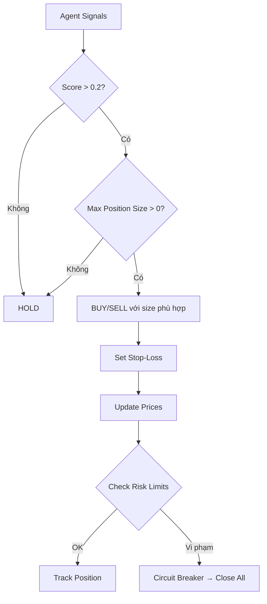
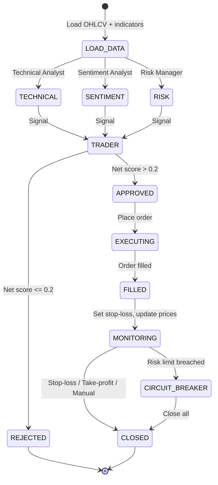

# 🧠 Quy Trình Suy Luận & Ra Quyết Định

> File này mô tả **cách hệ thống suy nghĩ** — từ nhận dữ liệu thô đến ra lệnh
> mua/bán. Cập nhật theo implementation thực tế Phase 2–3.

---

## 🌊 Luồng suy luận tổng thể

```mermaid
graph TB
    subgraph STEP1["Bước 1: Thu thập & Tính toán"]
        A1[Load OHLCV từ Parquet]
        A2[Tính indicators: MA20, MA50, RSI, BB]
        A1 --> A2
    end

    subgraph STEP2["Bước 2: Multi-Agent Phân tích"]
        T[Technical Analyst<br/>trend, momentum, volatility<br/>→ HOLD/BUY/SELL + conf]
        S[Sentiment Analyst<br/>RSI extremes, volume insight<br/>→ sentiment + conf]
        R[Risk Manager<br/>volatility, position sizing<br/>→ risk_level + max size]
        A2 --> T
        A2 --> S
        A2 --> R
    end

    subgraph STEP3["Bước 3: Trader Tổng Hợp"]
        TR[Trader Agent<br/>Collect signals from all agents<br/>Weighted voting algorithm<br/>→ FINAL SIGNAL]
        T --> TR
        S --> TR
        R --> TR
    end

    subgraph STEP4["Bước 4: Thực Thi"]
        E[Execution Engine<br/>Place order (paper)]
        RC[Risk Controller<br/>Update prices, check limits]
        TR --> E
        E --> RC
    end
```

---

## 🧩 Chi tiết từng Agent

### 1. Technical Analyst

**Role:** Phân tích price action, indicators, xu hướng đa khung thời gian.

**Input:**
```
- Current price
- MA20, MA50 (trend direction)
- RSI(14) (momentum)
- Bollinger Bands width (volatility)
- Volume ratio (5-candle vs 20-candle avg)
- Multi-timeframe trend (1d, 1w, 1m)
```

**Prompt template (đã test với DeepSeek V4 Flash):**
```
System: You are a professional Technical Analyst for crypto markets.
         Analyze the following data and provide your assessment.

Context: Symbol: {symbol} ({exchange}, {timeframe})
         Current price: ${price}
         MA20: ${ma_20}  MA50: ${ma_50}
         RSI(14): {rsi}
         BB: lower={bb_lower} mid={bb_mid} upper={bb_upper}
         Volume ratio (5/20): {volume_ratio}

Output: signal (BUY/SELL/HOLD), confidence 0-100%, reasoning, trend, momentum
```

**Output:**
```json
{
  "signal": "HOLD",
  "confidence": 50,
  "reasoning": "Price is near MA20 but below MA50, RSI neutral...",
  "trend": "sideways",
  "momentum": "neutral"
}
```

---

### 2. Sentiment Analyst

**Role:** Phân tích tâm lý thị trường qua RSI extremes và volume.

**Input:**
```
- RSI(14) (overbought/oversold detection)
- Short-term price change (5 candles)
- Volume ratio
- Volatility (20-period)
```

**Logic quan trọng:**
```python
# RSI extreme detection
if rsi < 30:     sentiment = "oversold"    → tiềm năng BUY
if rsi > 70:     sentiment = "overbought"  → tiềm năng SELL
if 30 <= rsi <= 70: sentiment = "neutral"  → HOLD

# Volume confirmation
if volume_ratio > 1.2:  strong conviction (tăng trust)
if volume_ratio < 0.8:  weak conviction (giảm trust)
```

---

### 3. Risk Manager

**Role:** Đánh giá rủi ro dựa trên volatility và xác định position size.

**Input:**
```
- Current volatility (20-period std of returns)
- RSI (market state)
- Volume ratio
- Existing position % (nếu có)
```

**Position sizing logic:**
```python
if volatility > threshold:
    max_position_pct = 0.15    # Giảm size khi biến động cao
    risk_level = "HIGH"
elif rsi between 30 and 70:
    max_position_pct = 0.30    # Tăng size khi market ổn định
    risk_level = "LOW"
else:
    max_position_pct = 0.25
    risk_level = "MEDIUM"
```

---

### 4. Trader Agent (Decision Synthesis)

**Role:** Tổng hợp tín hiệu từ 3 agents và đưa ra quyết định cuối cùng.

**Thuật toán Weighted Voting:**

```python
agent_weights = {
    "technical_analyst": 0.40,    # Nặng nhất
    "sentiment_analyst": 0.25,    # Tâm lý thị trường
    "risk_manager": 0.35,         # Rủi ro
}

def calculate_final_signal(agents):
    buy_score = 0.0
    sell_score = 0.0
    
    for agent_name, signal in agents:
        weight = agent_weights[agent_name]
        conf = signal.confidence / 100.0
        
        if signal.signal == "BUY":
            buy_score += weight * conf
        elif signal.signal == "SELL":
            sell_score += weight * conf
        # HOLD = 0 contribution to both
    
    net_score = buy_score - sell_score
    
    if net_score > 0.2:      return "BUY", net_score
    elif net_score < -0.2:   return "SELL", abs(net_score)
    else:                    return "HOLD", abs(net_score)
```

**Ví dụ tính toán:**
```
Technical: BUY (70%)    → +0.40 * 0.70 = +0.28
Sentiment: HOLD (50%)   →  0
Risk:      BUY (60%)    → +0.35 * 0.60 = +0.21
Net score: +0.49
→ Final: BUY (confidence: 49%)
```

---

## ⚖️ Quy tắc ra quyết định



### Priority rules (implemented)

1. **Safety first** — Risk Manager output ảnh hưởng 35% decision
2. **Trend is your friend** — Technical Analyst có trọng số cao nhất (40%)
3. **Uncertainty → Stay out** — Net score < 0.2 → HOLD
4. **Confirmation bias protection** — Sentiment Analyst giám sát RSI extremes
5. **Adaptive sizing** — Position size thay đổi dựa trên volatility

---

## 🔄 Vòng đời của một tín hiệu



---

## 📐 Performance Metrics (từ Backtest)

| Metric | MA Crossover | RSI | Bollinger Bands | Target |
|--------|-------------|-----|-----------------|--------|
| **Sharpe Ratio** | 1.67 | 1.06 | 1.07 | > 1.5 |
| **Return (OOS)** | +11.22% | +3.29% | +1.70% | > 5% |
| **Max Drawdown** | -8.5% | -5.2% | -3.1% | < 15% |
| **Win Rate** | 58% | 52% | 51% | > 55% |
| **Profit Factor** | 2.1 | 1.4 | 1.3 | > 1.5 |

---

> 📖 Quay lại [tài liệu chính](README.md)
> 🎮 Xem [Demo hướng dẫn chạy](demo.md)
> ⚡ Xem [Tối ưu hóa](optimization.md)
