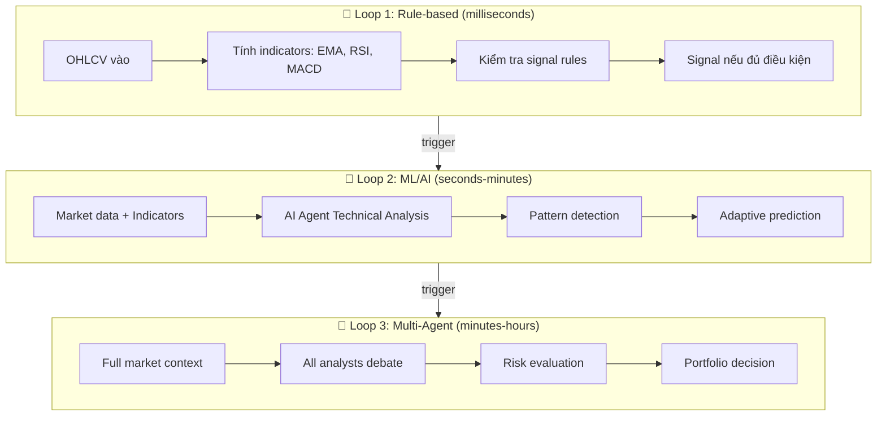
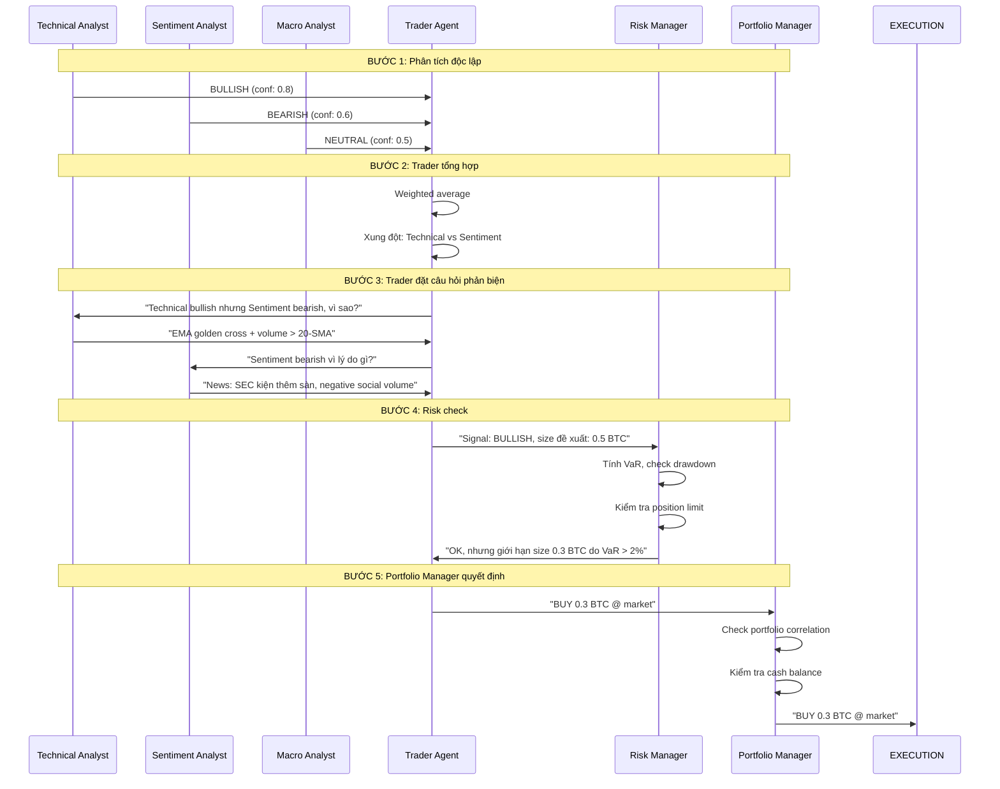
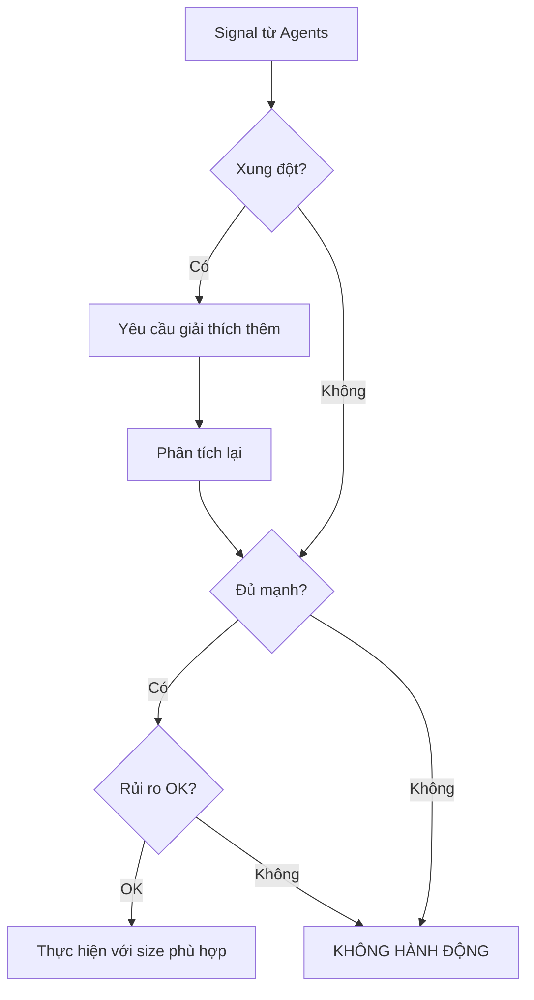
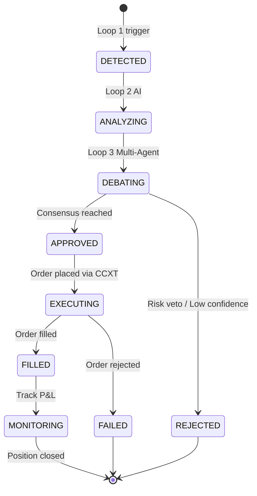

# 🧠 Quy Trình Suy Luận & Ra Quyết Định

> File này mô tả **cách hệ thống suy nghĩ** — từ nhận dữ liệu thô đến ra lệnh
> mua/bán. Đây là phần quan trọng nhất của toàn bộ hệ thống.

---

## 🌊 3 Vòng Suy Luận (Three Loops of Reasoning)

Hệ thống có 3 vòng suy luận, từ nhanh đến sâu:



| Vòng | Thời gian | Mục đích | Công nghệ |
|------|-----------|---------|-----------|
| **Loop 1** | ms | Phát hiện tín hiệu nhanh (trend following, breakout) | Rule-based, TA-Lib |
| **Loop 2** | s → phút | Phân tích sâu hơn với ML/AI | LLM + Indicators |
| **Loop 3** | phút → giờ | Ra quyết định chiến lược, multi-agent | Multi LLM agents + debate |

---

## 🧩 Chi tiết Loop 1: Rule-based

Chạy **mỗi lần có candle mới** (1 phút / 5 phút / 1h tùy timeframe).

```
Input:   OHLCV mới nhất
         ├── Tính: EMA(9), EMA(21), EMA(50)
         ├── Tính: RSI(14)
         ├── Tính: MACD(12,26,9)
         └── Tính: Volume SMA(20)

Logic:
         IF close > EMA(9) AND EMA(9) > EMA(21)
             → Signal: BULLISH (strength: +1)
         IF RSI < 30 AND close < BB_LOWER
             → Signal: OVERSOLD (strength: +2)
         IF MACD > SIGNAL AND MACD_HISTOGRAM > 0
             → Signal: MOMENTUM_UP (strength: +1)

Output:  dict{signal, strength, confidence}
         → gửi lên Loop 2 nếu tổng strength >= threshold
```

### Các chiến lược mẫu (strategy templates)

| Strategy | Parameters | Timeframe | Best for |
|----------|-----------|-----------|---------|
| **EMA Cross** | fast=9, slow=21 | 1h, 4h | Trend following |
| **RSI Mean Reversion** | period=14, oversold=30, overbought=70 | 15m, 1h | Sideways market |
| **MACD Momentum** | fast=12, slow=26, signal=9 | 1h, 4h | Momentum trading |
| **Bollinger Squeeze** | period=20, std=2 | 1h | Volatility breakout |
| **Volume Profile** | Volume SMA(20) | 1h, 4h | Volume confirmation |

---

## 🧠 Chi tiết Loop 2: AI Single-Agent

Khi Loop 1 phát hiện tín hiệu đủ mạnh → Loop 2 được kích hoạt.

```
INPUT:  - Candle hiện tại + 100 candles trước
        - Các indicators đã tính
        - Tín hiệu từ Loop 1

PROMPT STRUCTURE:
────────────────────────────────────────────
System:  Bạn là Technical Analyst AI.
         Phân tích chart và đưa ra nhận định.

Context: Symbol: BTC/USDT (Binance, 1h)
         Current price: $63,915
         EMA9: $63,800 | EMA21: $63,200
         RSI(14): 58.2
         MACD: bullish, histogram đang tăng

Task:    Đánh giá xu hướng hiện tại.
         Có nên mua theo tín hiệu không?
         Rủi ro chính là gì?

Constraints:
         - Chỉ dùng dữ liệu được cung cấp
         - Nêu rõ mức độ tự tin (%)
         - Nếu không đủ dữ liệu → nói không
────────────────────────────────────────────

OUTPUT:
{
  "judgment": "BULLISH" | "BEARISH" | "NEUTRAL",
  "confidence": 0.75,
  "reasoning": "EMA9 đã cắt lên trên EMA21 (golden cross). "
               "RSI ở 58, không quá mua. MACD histogram dương. "
               "Khối lượng tăng nhẹ.",
  "risk": "Giá đang test resistance $64,200. "
          "Nếu reject có thể retest $63,200.",
  "suggested_action": "BUY với size nhỏ (25% position)"
}
```

---

## 🏛 Chi tiết Loop 3: Multi-Agent Debate

Đây là điểm mạnh nhất của hệ thống — nhiều AI agents với chuyên môn khác nhau
**tranh luận** với nhau trước khi ra quyết định.



### Trọng số mặc định

```yaml
agent_weights:
  technical_analyst: 0.35    # Nặng nhất — price action là truth
  sentiment_analyst: 0.25    # News ngắn hạn
  fundamental_analyst: 0.25  # On-chain dài hạn
  macro_analyst: 0.15        # Vĩ mô — ảnh hưởng dần

# Quyết định dựa trên weighted vote:
#   score < 0.2 → HOLD
#   0.2 ≤ score < 0.6 → nhẹ (25% position)
#   0.6 ≤ score < 0.8 → vừa (50% position)
#   score ≥ 0.8 → mạnh (75-100% position)
```

---

## ⚖️ Nguyên tắc ra quyết định



### Priority rules

1. **Safety first** — Risk manager có thể veto bất kỳ lệnh nào
2. **Consensus > Majority** — Nếu các analyst đồng thuận, trust cao hơn
3. **Time decay** — Tin hiệu cũ hơn 5 phút phải được refresh
4. **Uncertainty → Stay out** — Nếu confidence < 0.4, không hành động
5. **Trend is your friend** — Technical analyst có trọng số cao nhất

---

## 🔄 Vòng đời của một tín hiệu



---

## 📐 Công thức đánh giá hiệu suất

| Metric | Công thức | Target |
|--------|-----------|--------|
| **Sharpe Ratio** | (R_p - R_f) / σ_p | > 1.5 |
| **Sortino Ratio** | (R_p - R_f) / σ_downside | > 2.0 |
| **Max Drawdown** | max(peak - trough) / peak | < 20% |
| **Win Rate** | wins / total trades | > 55% |
| **Profit Factor** | gross profit / gross loss | > 1.5 |
| **Calmar Ratio** | CAGR / Max DD | > 1.0 |
| **Avg Trade** | avg return per trade | > 0.5% |

---

> 📖 Quay lại [tài liệu chính](README.md)
> 🎮 Xem [Demo hướng dẫn chạy](demo.md)
